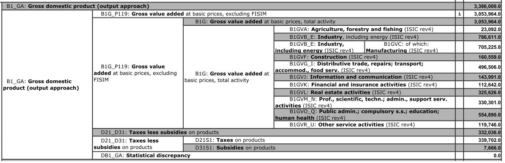
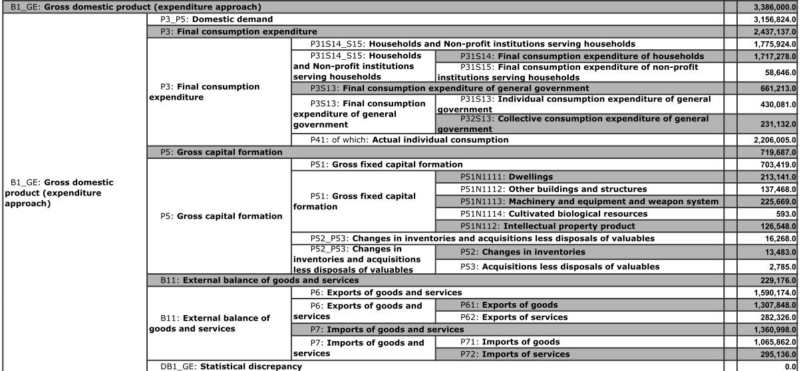

<!--..........................................................................-->
<!--..........................................................................-->

<!-- Include header -->

````{=html}
```{r, include=TRUE, echo=FALSE, results='asis'}
xfun::file_string('header_02.html')
```
````

```{r,include=FALSE}

knitr::opts_chunk$set(
  include = FALSE,
  echo = FALSE,
  warning = FALSE,
  message = FALSE,
  fig.width = 10,
  fig.height = 8
  )
options(scipen=1)
options(width=9999)

```

```{r,klippy, echo=FALSE, include=TRUE}
# See: https://rlesur.github.io/klippy/articles/klippy.html
klippy::klippy(tooltip_message = 'Click to copy', tooltip_success = 'Done', position = c('top', 'right'))
```

```{r}

upd.dat <- TRUE

```

<!--..........................................................................-->
<hr />

# VGR: Entstehung, Verwendung und Verteilung {.tabset .tabset-fade}

<hr />

*Dieses Dokument enthält eine Auswertung der VGR Daten von der OECD.* 

<hr />

<!--..........................................................................-->
## Vorbereitung {.tabset .tabset-fade}

<!--..........................................................................--> 
<button type="button" class="collapsible02"> Beschaffung der Daten </button>
<div class="col_content">

Wir verwenden die vierteljährlichen VGR Daten von der Organisation für wirtschaftliche Zusammenarbeit und Entwicklung (OECD).

Die Daten können über das R-Paket `oecd` direkt in die Software R geladen werden.

<!-- * R-Software, [Link](https://www.r-project.org/) -->
* R-Paket `oecd`, [Link](https://cran.r-project.org/web/packages/OECD/index.html): Search and extract data from the OECD
* Heruntergelden werden R-Pakete mit: `install.packages(OECD)`.
* Geladen werden R-Pakete mit: `library(OECD)`.

```{r,include=TRUE}

library(OECD)

```

</div>
<!--..........................................................................--> 

<!--..........................................................................--> 
<button type="button" class="collapsible02"> Auswertung der Daten </button>
<div class="col_content">

Für die Auswertung verwenden wir vorwiegend *R*-Pakete Teil der *base* Installation.

Außerde verwenden wir außerdem folgenden *R*-Pakete:

* `ggplot2`, [Link](https://cran.r-project.org/web/packages/ggplot2/index.html): Create elegant data visualisations using the grammar of graphics
* `dplyr`, [Link](https://cran.r-project.org/web/packages/dplyr/index.html): A grammar of data manipulation
* `tidyr`, [Link](https://cran.r-project.org/web/packages/tidyr/index.html): Tidy messy data
* `lubridate`, [Link](https://cran.r-project.org/web/packages/lubridate/index.html): Make dealing with dates a little easier
* `scales`, [Link](https://cran.r-project.org/web/packages/scales/index.html): Scale functions for visualization
* `zoo`, [Link](https://cran.r-project.org/web/packages/zoo/index.html): S3 Infrastructure for Regular and Irregular Time Series (Z's Ordered Observations)

<!-- <p class="note01"> -->
<!-- Hinweis: Eine benutzerfreundlichere Implementierung würde mehr die Pakete `dplyr`, `tidyr` einbeziehen.  -->
<!-- </p> -->

```{r,include=TRUE}

library(ggplot2)
library(dplyr)
library(tidyr)
library(lubridate)
library(scales)
library(zoo)

```

Die folgenden *R*-Pakete werden für die Darstellung der Ergebnisse verwendet:

* `gridExtra`, [Link](https://cran.r-project.org/web/packages/gridExtra/index.html): Miscellaneous functions for "grid" graphics
* `kableExtra`, [Link](https://cran.r-project.org/web/packages/kableExtra/index.html): Construct complex table with 'kable' and pipe syntax

```{r, include=TRUE, echo=TRUE}

library(gridExtra)
library(kableExtra)

```

Die folgenden *R*-Funktionen werden zur Berechnung von Anteilen, Differenzen, und Wachstumsbeiträgen verwendet.

```{r, include=TRUE, echo=TRUE}

L01_fun  <- function(x) (lag(x, n = 1)) # Construct lag
D01_fun  <- function(x) (lag(x, n = 0) - lag(x, n = 1)) # Construct difference
G01_fun  <- function(x) ((lag(x, n = 0) - lag(x, n = 1))/lag(x, n = 1)*100) # Construct growth rate
X00_fun  <- function(x,y) (x/y)*100 # Construct share
GX01_fun <- function(x,y) ((lag(x, n = 0) - lag(x, n = 1))/lag(x, n = 1)*100*lag(x, n = 1)/lag(y, n = 1)) # Construct growth contribution

```

Die folgenden *R*-Funktionen werden verwendet um bestimmte Umformungen der Daten vorzunehmen.

```{r, include=TRUE, echo=TRUE}

dat_man_fun <- function(dat.fra, arg.lis, col.nam.sel, col.nam.out){
  
  # add dat.fra as first element to list
  arg.lis[[1]] <- dat.fra
  
  # select columns of dat.fra
  dat.fra <- arg.lis[[1]]
  arg.lis[[1]] <- subset(arg.lis[[1]], select = col.nam.sel)

  # core only
  do.call(apply, args = arg.lis)
  
  # altogether
  res <- cbind(dat.fra,
               setNames(
                 as.data.frame(
                   do.call(
                     apply, args = arg.lis)), col.nam.out))
  
  return(res)

}

```

```{r}

dat_man_fun_chk <- function(dat.fra, arg.lis, col.nam.sel, col.nam.out){
  
  # Note:
  # -> Use margin 1 to apply transformation row-by-row
  # -> Use arg.lis[[1]]=NULL as dummy for dat.fra

  
  # # Checks:
  # dat.fra <- dat.w.00
  # # fun.nam <- L.fun
  # col.nam.sel <- c("B1_GA")
  # col.nam.out <- c("L01_B1_GA")
  # arg.lis <- list(X=NULL, MARGIN=2, FUN="L01_fun")
  # arg.lis
  
  
  
  # add dat.fra as first element to list
  arg.lis[[1]] <- dat.fra
  # select columns of dat.fra
  dat.fra <- arg.lis[[1]]
  arg.lis[[1]] <- subset(arg.lis[[1]],select=col.nam.sel)
  arg.lis
  
  do.call(apply,args=arg.lis)
  res <- cbind(dat.fra,
               setNames(
                 as.data.frame(
                   do.call(
                     apply,args=arg.lis)),col.nam.out))
  
  # head(res)
  
  return(res)

}

```

```{r, include=TRUE, echo=TRUE}

oecd_qna_fun <- function(dat, loc, sub, mea, fre, sta.dat, end.dat, sub.inp.lis) {
  
  # Download if necessary!
  if(is.null(dat)){
    # Input list
    fil <- list(loc, sub, mea, fre)
    # > Download
    qna.dat <- get_dataset(dataset = "QNA", filter = fil) %>%
      subset(yq(Time) %in% seq(sta.dat, end.dat, by = "quarter")) # filter time period
  } 
  if(!is.null(dat)){
    qna.dat <- dat %>%
      subset(LOCATION %in% loc) %>%
      subset(SUBJECT %in% sub) %>%
      subset(MEASURE %in% mea) %>%
      subset(FREQUENCY %in% fre) %>%
      subset(yq(Time) %in% seq(sta.dat, end.dat, by = "quarter"))
  }

  # > Transform data to wide
  dat.l.00 <- qna.dat # long format
  dat.w.00 <- dat.l.00 %>%
    subset(select = c("LOCATION", "Time", "SUBJECT", "ObsValue")) %>%
    spread(SUBJECT, ObsValue) # wide format
  # Note: tidyr (1st generation) approach
  
  # > Construct sector aggregates
  nn <- length(sub.inp.lis)
  sub.inp.lab <- names(sub.inp.lis)
  dat.01 <- dat.w.00
  for (ii in (1:nn)) {
    dat.01 <- dat.01 %>%
      dat_man_fun(list(X = NULL, MARGIN = 1, FUN = "sum"), sub.inp.lis[[ii]], sub.inp.lab[[ii]])
  }

  # > Construct sector shares
  sub.sel <- sub.inp.lab
  sub.x  <-  paste(sub.sel, "_X00", sep = "")
  sub.g  <-  paste(sub.sel, "_G01", sep = "")
  sub.gx <-  paste(sub.sel, "_GX01", sep = "")
  
  dat.02 <- dat.01 %>% 
    dat_man_fun(list(X = NULL, MARGIN = 2, FUN = "X00_fun", y = dat.01$tot), sub.sel, sub.x) %>%
    dat_man_fun(list(X = NULL, MARGIN = 2, FUN = "G01_fun"), sub.sel, sub.g) %>%
    dat_man_fun(list(X = NULL, MARGIN = 2, FUN = "GX01_fun", y = dat.01$tot), sub.sel, sub.gx)

  dat.03 <- dat.02 %>%
    subset(select = c("LOCATION", "Time", sub.sel, sub.x,sub.g,sub.gx))

  # > Select values and transform wide to long
  dat.04 <- dat.02 %>% 
    gather(SUBJECT,ObsValue,sub.sel[1]:sub.gx[nn]) %>% # long format
    subset(select = c("LOCATION", "Time", "SUBJECT", "ObsValue"))

  ret.lis <- list(dat = dat.02,
                  dat.03 = dat.03,
                  dat.04 = dat.04,
                  sub.sel = sub.sel, sub.x = sub.x, sub.g = sub.g, sub.gx = sub.gx,
                  end.dat = end.dat, sta.dat = sta.dat,
                  nn = nn)

  return(ret.lis)
  
}

```

```{r}

oecd_qna_fun_chk <- function(dat,loc,sub,mea,fre,sta.dat,end.dat,sub.inp.lis) {
  
  # # inputs
  # dat <- qna.dat.00
  # subset(dat,SUBJECT %in% sub)
  # 
  # loc <- loc
  # sub <- sub
  # mea <- mea
  # sta.dat <- sta.dat
  # end.dat <- end.dat
  # 
  # sub.inp.lis <- sub.inp.lis
  
  
  
  # Download if necessary!
  if(is.null(dat)){
    # Input list
    fil <- list(loc,sub,mea,fre)
    # > Download
    qna.dat <- get_dataset(dataset="QNA", filter=fil) %>%
      subset(yq(Time) %in% seq(sta.dat, end.dat, by="quarter")) # filter time period
  } 
  if(!is.null(dat)){
    qna.dat <- dat %>%
      subset(LOCATION %in% loc) %>%
      subset(SUBJECT %in% sub) %>%
      subset(MEASURE %in% mea) %>%
      subset(FREQUENCY %in% fre) %>%
      subset(yq(Time) %in% seq(sta.dat, end.dat, by="quarter"))
  }

  # > Transform data to wide
  dat.l.00 <- qna.dat # long format
  dat.w.00 <- dat.l.00 %>%
    subset(select=c("LOCATION","Time","SUBJECT","ObsValue")) %>%
    spread(SUBJECT, ObsValue) # wide format
  # Note: tidyr (1st generation) approach
  
  # > Construct sector aggregates
  nn <- length(sub.inp.lis)
  sub.inp.lab <- names(sub.inp.lis)
  dat.01 <- dat.w.00
  for (ii in (1:nn)) {
    dat.01 <- dat.01 %>%
      dat_man_fun(list(X=NULL, MARGIN=1, FUN="sum"), sub.inp.lis[[ii]], sub.inp.lab[[ii]])
  }
  head(dat.01)

  # > Construct sector shares
  sub.sel <- sub.inp.lab
  sub.x  <-  paste(sub.sel,"_X00",sep="")
  sub.g  <-  paste(sub.sel,"_G01",sep="")
  sub.gx <-  paste(sub.sel,"_GX01",sep="")
  
  dat.02 <- dat.01 %>% 
    dat_man_fun(list(X=NULL, MARGIN=2, FUN="X00_fun", y=dat.01$tot), sub.sel, sub.x) %>%
    dat_man_fun(list(X=NULL, MARGIN=2, FUN="G01_fun"), sub.sel, sub.g) %>%
    dat_man_fun(list(X=NULL, MARGIN=2, FUN="GX01_fun", y=dat.01$tot), sub.sel, sub.gx)
  head(dat.02)
  View(dat.02)

  dat.03 <- dat.02 %>%
    subset(select = c("LOCATION","Time",sub.sel,sub.x,sub.g,sub.gx))
  head(dat.03)
  View(dat.03)
  
  # > Select values and transform wide to long
  dat.04 <- dat.02 %>% 
    gather(SUBJECT,ObsValue,sub.sel[1]:sub.gx[nn]) %>% # long format
    subset(select = c("LOCATION","Time","SUBJECT","ObsValue"))
  head(dat.04)
  View(dat.04)
  
  # head(gather(dat.02,SUBJECT,ObsValue,sub.sel[1],sub.gx[nn]))
  # View(gather(dat.02,SUBJECT,ObsValue,sub.sel[1],sub.gx[nn]))
  # 
  # xxx <- gather(dat.02,SUBJECT,ObsValue,sub.sel[1]:sub.gx[nn])
  # yyy <- subset(xxx,select = c("LOCATION","Time","SUBJECT","ObsValue"))
  # head(yyy)

  ret.lis <- list(dat=dat.02,
                  dat.03=dat.03,
                  dat.04=dat.04,
                  sub.sel=sub.sel,sub.x=sub.x,sub.g=sub.g,sub.gx=sub.gx,
                  end.dat=end.dat,sta.dat=sta.dat,
                  nn=nn)
  
  return(ret.lis)
  
}

```

</div>
<!--..........................................................................--> 

<!--..........................................................................--> 
<button type="button" class="collapsible02"> Struktur der Daten: Entstehung </button>
<div class="col_content">

<p class="head01">
Überblick
</p>

Beispiel: Land Deutschland, 2018  



</div>
<!--..........................................................................--> 

<!--..........................................................................--> 
<button type="button" class="collapsible02"> Struktur der Daten: Verwendung </button>
<div class="col_content">

<p class="head01">
Überblick
</p>

Beispiel: Land Deutschland, 2018  



</div>
<!--..........................................................................--> 

<!-- IMPORTANT: Note, set eval=FALSE for fast compilation and not updated data or eval=TRUE for slow updated data -->

<!--..........................................................................--> 
<button type="button" class="collapsible02"> Struktur VGR Daten </button>
<div class="cod_content">

Die Struktur der VGR Daten der OECD kann duch die Funktion `get_data_structure` heruntergalden werden.

```{r,include=TRUE,cache=FALSE,eval=FALSE,echo=TRUE}

source("https://raw.githubusercontent.com/mmoessler/macro-dashboard/main/r-scripts/r_oecd_helper_functions.R")
qna.str <- OECD_get_data_structure_fun("QNA")

```

```{r,include=FALSE,cache=FALSE,eval=TRUE,echo=TRUE}

# > Call get_data_structure
# qna.str <- get_data_structure("QNA")

source("https://raw.githubusercontent.com/mmoessler/macro-dashboard/main/r-scripts/r_oecd_helper_functions.R")

if (upd.dat) {
  qna.str <- OECD_get_data_structure_fun("QNA")
}

```

```{r, include=FALSE, eval=TRUE}

if (upd.dat) {
  save(qna.str, file = "./data/qna_str.RData")
} else {
  load(file = "./data/qna_str.RData")
}

```

```{r,include=TRUE, echo=TRUE}

qna.str$VAR_DESC

```

</div>
<!--..........................................................................--> 

<!--..........................................................................--> 
<button type="button" class="collapsible02"> VGR Daten </button>
<div class="cod_content">

Die Daten können duch die Funktion `get_dataset` heruntergalden werden.

```{r,include=TRUE,cache=FALSE,eval=FALSE,echo=TRUE}

# > Inputs for download
# loc <- qna.str$LOCATION[,1]
loc <- c("DEU", "FRA", "ITA", "EA20", "GBR", "USA")
sub <- qna.str$SUBJECT[,1]
mea <- c("LNBQRSA") # Measure: Constant prices seasonal adjusted
fre <- c("Q") # Frequency: Quarterly frequency
sta.dat <- as.Date("2005-01-01") # Periods: "yyyy-mm-dd"
end.dat <- as.Date("2023-04-01")
# Note: Q1: 2020-01-01; Q2: 2020-04-01; Q3: 2020-07-01; Q4: 2020-10-01
fil <- list(loc, sub, mea, fre) # Collect inputs for get_dataset function

# > Download
qna.dat.00 <- get_dataset(dataset = "QNA", filter = fil)

qna.dat.00 <- get_dataset(dataset = "QNA", filter = fil) %>%
  subset(yq(Time) %in% seq(sta.dat, end.dat, by = "quarter")) # filter time period

qna.dat.00$ObsValue <- as.numeric(qna.dat.00$ObsValue)

head(qna.dat.00)

```

```{r,include=TRUE,cache=FALSE,eval=TRUE,echo=TRUE}

# > Inputs for download
# loc <- qna.str$LOCATION[,1]
loc <- c("DEU", "FRA", "ITA", "EA20", "GBR", "USA")
sub <- qna.str$SUBJECT[,1]
mea <- c("LNBQRSA") # Measure: Constant prices seasonal adjusted
fre <- c("Q") # Frequency: Quarterly frequency
sta.dat <- as.Date("2005-01-01") # Periods: "yyyy-mm-dd"
end.dat <- as.Date("2023-04-01")
# Note: Q1: 2020-01-01; Q2: 2020-04-01; Q3: 2020-07-01; Q4: 2020-10-01
fil <- list(loc, sub, mea, fre) # Collect inputs for get_dataset function

if (upd.dat) {

  # > Download
  # qna.dat.00 <- get_dataset(dataset = "QNA", filter = fil) %>%
  #   mutate(Time = Time) %>%
  #   subset(yq(Time) %in% seq(sta.dat, end.dat, by = "quarter")) # filter time period
  
  # > Download
  qna.dat.00 <- get_dataset(dataset = "QNA", filter = fil)
  
  # qna.dat.00 <- get_dataset(dataset = "QNA", filter = fil) %>%
  #   subset(yq(Time) %in% seq(sta.dat, end.dat, by = "quarter")) # filter time period
  
  qna.dat.00 <- get_dataset(dataset = "QNA", filter = fil) %>%
    subset(yq(Time) %in% seq(sta.dat, end.dat, by = "quarter")) # filter time period
  
  qna.dat.00$ObsValue <- as.numeric(qna.dat.00$ObsValue)
  
  head(qna.dat.00)

} else {
  
  load("./data/qna_dat_00.RData")
  
  qna.dat.00$ObsValue <- as.numeric(qna.dat.00$ObsValue)
  
  head(qna.dat.00)
  
}

```

</div>
<!--..........................................................................--> 

<!--..........................................................................-->
<hr />

<p class="back01">
[Zurück zur *Startseite*](./index.html)
</p>

<!--..........................................................................-->
<hr />

<!--..........................................................................--> 
## Entstehung {.tabset .tabset-fade}

<!--..........................................................................--> 
### Deutschland {.tabset .tabset-fade}

<!--..........................................................................--> 
<button type="button" class="collapsible02"> Datenaufbereitung </button>
<div class="cod_content">

```{r,include=TRUE,echo=TRUE}

# > Germany, output
loc <- c("DEU") # Location: Germany
mea <- c("LNBQRSA") # Measure: Constant prices seasonal adjusted
fre <- c("Q") # Frequency: Quarterly frequency
sta.dat <- as.Date("2005-01-01") # Periods: "yyyy-mm-dd"
end.dat <- as.Date("2023-04-01")
# Note: Q1: 2020-01-01; Q2: 2020-04-01; Q3: 2020-07-01; Q4: 2020-10-01

sub <- c("B1_GA","B1GVA","B1GVB_E","B1GVF","B1GVG_I","B1GVJ","B1GVK","B1GVL","B1GVM_N","B1GVO_Q","B1GVR_U","D21_D31")
sub.agr <- c("B1GVA")
sub.ind <- c("B1GVB_E")
sub.con <- c("B1GVF")
sub.ser <- c("B1GVG_I","B1GVJ","B1GVK","B1GVL","B1GVM_N","B1GVO_Q","B1GVR_U")
sub.tls <- c("D21_D31") # taxes less subsidies on products
sub.tot <- c("B1_GA")
sub.inp.lis <- list(agr = sub.agr,
                    ind = sub.ind,
                    con = sub.con,
                    ser = sub.ser,
                    tls = sub.tls,
                    tot = sub.tot)

ger.out.01.res <- oecd_qna_fun(qna.dat.00, loc, sub, mea, fre, sta.dat, end.dat, sub.inp.lis)

```

```{r}

# > Sow results
head(ger.out.01.res$dat)
# > Check results
dat <- ger.out.01.res$dat
chk.01 <- dat$tot-   (dat$agr +   dat$ind +   dat$con +   dat$ser+   dat$tls)
chk.02 <- dat$tot_X- (dat$agr_X + dat$ind_X + dat$con_X + dat$ser_X+ dat$tls_X)
chk.03 <- dat$tot_GX-(dat$agr_GX +dat$ind_GX +dat$con_GX +dat$ser_GX+dat$tls_GX)
chk <- cbind(chk.01,chk.02,chk.03)
chk

```

</div>
<!--..........................................................................--> 

<!--..........................................................................--> 
<button type="button" class="collapsible02"> Darstellung: Anteile Level </button>
<div class="cod_content">

```{r,include=TRUE,echo=TRUE}

# > Inputs
oecd.qna.res <- ger.out.01.res

dat.inp <- oecd.qna.res$dat.04 %>%
  subset(yq(Time) %in% oecd.qna.res$end.dat) %>%
  subset(SUBJECT %in% oecd.qna.res$sub.x[-oecd.qna.res$nn])

# > Labels
lab.inp <- c("Landw.",
             "Bau",
             "Industrie",
             "Service",
             "St-Su")

# > Plot shares as pieplot
plt.x <- dat.inp %>%
  ggplot(aes(x = "", y = ObsValue, fill = SUBJECT)) +
  geom_bar(width = 1, stat = "identity") +
  coord_polar("y") +
  scale_fill_discrete(name = "", labels = lab.inp) +
  theme(legend.position = "bottom") +
  labs(x = "Anteil in Prozent", y = dat.inp[1,"Time"],
       caption = "Quelle: OECD, vierteljährliche VGR") +
  theme(plot.caption = element_text(face = "italic"))
plt.x

```

```{r, include=FALSE}

# # Save plot
# ggsave(plot=plt.x,width=10,height=6,dpi=300,filename = "./figures/DE_QNA_out_x_01.pdf")
# ggsave(plot=plt.x,width=10,height=6,dpi=300,filename = "./figures/DE_QNA_out_x_01.svg")

```

</div>
<!--..........................................................................--> 

<!--..........................................................................--> 
<button type="button" class="collapsible02"> Darstellung: Anteile Wachstum </button>
<div class="cod_content">

```{r,include=TRUE,echo=TRUE}

# > Inputs
oecd.qna.res <- ger.out.01.res

dat.inp <- oecd.qna.res$dat.04 %>%
  subset(yq(Time) %in% seq(as.Date(oecd.qna.res$sta.dat),as.Date(oecd.qna.res$end.dat),0.25)[-1]) %>%
  subset(SUBJECT %in% oecd.qna.res$sub.gx)

# > Labels
lab.inp <- c("Landw.",
             "Bau",
             "Industrie",
             "Service",
             "St-Su")

# > Plot growth contributions
plt.gx <- dat.inp %>%
  ggplot() +
  geom_bar(aes(y = ObsValue, x = as.yearqtr(Time, "%Y-Q%q"), fill = SUBJECT), position = "stack", stat = "identity", subset(dat.inp,SUBJECT %in% oecd.qna.res$sub.gx[-oecd.qna.res$nn])) +
  geom_point(aes(y = ObsValue, x = as.yearqtr(Time, "%Y-Q%q")), subset(dat.inp,SUBJECT %in% oecd.qna.res$sub.gx[oecd.qna.res$nn]), size = 0.5) +
  geom_line(aes(y = ObsValue, x = as.yearqtr(Time, "%Y-Q%q")), subset(dat.inp,SUBJECT %in% oecd.qna.res$sub.gx[oecd.qna.res$nn]), size = 0.5) +
  scale_fill_discrete(name="",labels = lab.inp) +
  theme(legend.position = "bottom") +
  labs(x = "",y = "Veränderung in Prozentpunkte (QoQ)",
       caption = "Quelle: OECD, vierteljährliche VGR") +
  theme(axis.text.x = element_text(angle = 90),
        plot.caption = element_text(face = "italic")) +  
  scale_x_yearqtr(breaks = seq(as.yearqtr(oecd.qna.res$sta.dat), as.yearqtr(oecd.qna.res$end.dat), 1)[-1],
                  minor_breaks = seq(as.yearqtr(oecd.qna.res$sta.dat), as.yearqtr(oecd.qna.res$end.dat), 0.25)[-1],
                  format = "%Y-Q%q",
                  expand = c(0, 0)) +
  scale_y_continuous(breaks = seq(-10, 10, 2))
plt.gx

```

```{r}

# Save plot
ggsave(plot=plt.x,width=6,height=6,dpi=300,filename = "./figures/DE_QNA_out_x_01.pdf")
ggsave(plot=plt.x,width=6,height=6,dpi=300,filename = "./figures/DE_QNA_out_x_01.svg")

ggsave(plot=plt.gx,width=10,height=6,dpi=300,filename = "./figures/DE_QNA_out_gx_01.pdf")
ggsave(plot=plt.gx,width=10,height=6,dpi=300,filename = "./figures/DE_QNA_out_gx_01.svg")

```

</div>
<!--..........................................................................--> 

```{r, include=FALSE}

# Wachstum level
dat <- ger.out.01.res$dat[,c("Time","B1_GA")]

dat %>%
  ggplot() +
  geom_line(aes(y=B1_GA,x=as.yearqtr(Time,"%Y-Q%q")))

```


<!--..........................................................................-->
<hr />

<p class="back01">
[Zurück zur *Startseite*](./index.html)
</p>

<!--..........................................................................-->
<hr />

<!--..........................................................................--> 
### Vergleich {.tabset .tabset-fade}

<!--..........................................................................--> 
<button type="button" class="collapsible02"> Funktion </button>
<div class="cod_content">

```{r,include=TRUE,echo=TRUE}

oecd_qna_out_fun <- function(loc, sta.dat, end.dat,
                             plt.x.tit = "", plt.gx.tit = ""){
  
  
  # > Data preparation
  # loc <- c("DEU") # Location: Germany
  mea <- c("LNBQRSA") # Measure: Constant prices seasonal adjusted
  fre <- c("Q") # Frequency: Quarterly frequency
  # sta.dat <- as.Date("2005-01-01") # Periods: "yyyy-mm-dd"
  # end.dat <- as.Date("2023-04-01")
  # Note: Q1: 2020-01-01; Q2: 2020-04-01; Q3: 2020-07-01; Q4: 2020-10-01

  sub <- c("B1_GA","B1GVA","B1GVB_E","B1GVF","B1GVG_I","B1GVJ","B1GVK","B1GVL","B1GVM_N","B1GVO_Q","B1GVR_U","D21_D31")
  sub.agr <- c("B1GVA")
  sub.ind <- c("B1GVB_E")
  sub.con <- c("B1GVF")
  sub.ser <- c("B1GVG_I","B1GVJ","B1GVK","B1GVL","B1GVM_N","B1GVO_Q","B1GVR_U")
  sub.tls <- c("D21_D31") # taxes less subsidies on products
  sub.tot <- c("B1_GA")
  sub.inp.lis <- list(agr = sub.agr,
                      ind = sub.ind,
                      con = sub.con,
                      ser = sub.ser,
                      tls = sub.tls,
                      tot = sub.tot)

  out.01.res <- oecd_qna_fun(qna.dat.00, loc, sub, mea, fre, sta.dat, end.dat, sub.inp.lis)
  
  
  # > Illustration share levels
  oecd.qna.res <- out.01.res

  dat.inp <- oecd.qna.res$dat.04 %>%
    subset(yq(Time) %in% oecd.qna.res$end.dat) %>%
    subset(SUBJECT %in% oecd.qna.res$sub.x[-oecd.qna.res$nn])

  # >> Labels
  lab.inp <- c("Landw.",
               "Bau",
               "Industrie",
               "Service",
               "St-Su")

  # >> Plot shares as pieplot
  plt.x <- dat.inp %>%
    ggplot(aes(x = "", y = ObsValue, fill = SUBJECT)) +
    geom_bar(width = 1, stat = "identity") +
    coord_polar("y") +
    scale_fill_discrete(name = "", labels = lab.inp) +
    theme(legend.position = "bottom") +
    labs(x = "Anteil in Prozent", y = dat.inp[1,"Time"],
         title = plt.x.tit,
         caption = "Quelle: OECD, vierteljährliche VGR") +
    theme(plot.caption = element_text(face = "italic"))
  
  
  # > Illustration growth contribution
  oecd.qna.res <- out.01.res

  dat.inp <- oecd.qna.res$dat.04 %>%
    subset(yq(Time) %in% seq(as.Date(oecd.qna.res$sta.dat), as.Date(oecd.qna.res$end.dat), 0.25)[-1]) %>%
    subset(SUBJECT %in% oecd.qna.res$sub.gx)

  # >> Labels
  lab.inp <- c("Landw.",
               "Bau",
               "Industrie",
               "Service",
               "St-Su")

  # >> Plot growth contributions
  plt.gx <- dat.inp %>%
    ggplot() +
    geom_bar(aes(y = ObsValue, x = as.yearqtr(Time, "%Y-Q%q"), fill = SUBJECT), position = "stack", stat = "identity", subset(dat.inp,SUBJECT %in% oecd.qna.res$sub.gx[-oecd.qna.res$nn])) +
    geom_point(aes(y = ObsValue, x = as.yearqtr(Time, "%Y-Q%q")), subset(dat.inp,SUBJECT %in% oecd.qna.res$sub.gx[oecd.qna.res$nn]), size = 0.5) +
    geom_line(aes(y = ObsValue, x = as.yearqtr(Time, "%Y-Q%q")), subset(dat.inp,SUBJECT %in% oecd.qna.res$sub.gx[oecd.qna.res$nn]), size = 0.5) +
    scale_fill_discrete(name = "", labels = lab.inp) +
    theme(legend.position = "bottom") +
    labs(x = "", y = "Veränderung in Prozentpunkte (QoQ)",
         title = plt.gx.tit,
         caption = "Quelle: OECD, vierteljährliche VGR") +
    theme(axis.text.x = element_text(angle = 90),
          plot.caption = element_text(face = "italic")) +  
    scale_x_yearqtr(breaks = seq(as.yearqtr(oecd.qna.res$sta.dat), as.yearqtr(oecd.qna.res$end.dat), 1)[-1],
                    minor_breaks = seq(as.yearqtr(oecd.qna.res$sta.dat), as.yearqtr(oecd.qna.res$end.dat), 0.25)[-1],
                    format = "%Y-Q%q",
                    expand = c(0, 0)) +
    scale_y_continuous(breaks = seq(-20, 20, 2))
  
  ret.lis <- list(plt.x=plt.x, plt.gx=plt.gx, out.01.res=out.01.res, lab.inp=lab.inp)
  
  return(ret.lis)
  
}

```

</div>
<!--..........................................................................--> 

<!--..........................................................................--> 
<button type="button" class="collapsible02"> Aufrufen der Funktion </button>
<div class="cod_content">

```{r,include=TRUE,echo=TRUE}

# > Start and end date
sta.dat <- as.Date("2005-01-01") # Periods: "yyyy-mm-dd"
end.dat <- as.Date("2023-04-01")
# Note: Q1: 2020-01-01; Q2: 2020-04-01; Q3: 2020-07-01; Q4: 2020-10-01

# > Germany
loc <- c("DEU")
oecd.qna.out.ger <- oecd_qna_out_fun(loc, sta.dat, end.dat, plt.x.tit = "Deutschland (Anteile)", plt.gx.tit = "Deutschland (Wachstumsbeiträge)")
# > France
loc <- c("FRA")
oecd.qna.out.fra <- oecd_qna_out_fun(loc, sta.dat, end.dat, plt.x.tit = "Frankreich (Anteile)", plt.gx.tit = "Frankreich (Wachstumsbeiträge)")
# > Italy
loc <- c("ITA")
oecd.qna.out.ita <- oecd_qna_out_fun(loc, sta.dat, end.dat, plt.x.tit = "Italien (Anteile)", plt.gx.tit = "Italien (Wachstumsbeiträge)")
# # > USA
# loc <- c("USA")
# oecd.qna.out.usa <- oecd_qna_out_fun(loc, sta.dat, end.dat, plt.x.tit = "Vereinigte Staaten (Anteile)", plt.gx.tit = "Vereinigte Staaten (Wachstumsbeiträge)")
# > Eurozone
loc <- c("EA20")
oecd.qna.out.ea20 <- oecd_qna_out_fun(loc, sta.dat, end.dat, plt.x.tit = "Euroraum (Anteile)", plt.gx.tit = "Euroraum (Wachstumsbeiträge)")
# > United Kingdom
loc <- c("GBR")
oecd.qna.out.gbr <- oecd_qna_out_fun(loc, sta.dat, end.dat, plt.x.tit = "Vereinigtes Königreich (Anteile)", plt.gx.tit = "Vereinigtes Königreich (Wachstumsbeiträge)")

```

</div>
<!--..........................................................................--> 

<!--..........................................................................--> 
<button type="button" class="collapsible02"> Darstellung der Ergebnisse No 01 </button>
<div class="cod_content">

```{r,include=FALSE,fig.width=8,fig.height=4}

# > Germany ----
grid.arrange(oecd.qna.out.ger$plt.x, oecd.qna.out.ger$plt.gx, ncol = 2)
# > France ----
grid.arrange(oecd.qna.out.fra$plt.x, oecd.qna.out.fra$plt.gx, ncol = 2)
# # > USA ----
# grid.arrange(oecd.qna.out.usa$plt.x,oecd.qna.out.usa$plt.gx,ncol=2)
# > Italy ----
grid.arrange(oecd.qna.out.ita$plt.x, oecd.qna.out.ita$plt.gx, ncol = 2)
# > Euro Area ----
grid.arrange(oecd.qna.out.ea20$plt.x, oecd.qna.out.ea20$plt.gx, ncol = 2)
# > United Kingdom ----
grid.arrange(oecd.qna.out.gbr$plt.x, oecd.qna.out.gbr$plt.gx, ncol = 2)

```

```{r,include=TRUE,fig.width=10,fig.height=5}

# > Germany & France----
grid.arrange(oecd.qna.out.ger$plt.x, oecd.qna.out.fra$plt.x, ncol = 2)
# > Italy & United Kingdom ----
grid.arrange(oecd.qna.out.ita$plt.x, oecd.qna.out.gbr$plt.x, ncol = 2)
# # > USA ----
# grid.arrange(oecd.qna.out.usa$plt.x, ncol = 1)
# > Euro Area ----
grid.arrange(oecd.qna.out.ea20$plt.x,ncol = 2)

```

</div>
<!--..........................................................................--> 

<!--..........................................................................--> 
<button type="button" class="collapsible02"> Darstellung der Ergebnisse No 02 </button>
<div class="cod_content">

```{r,include=TRUE,fig.width=10,fig.height=5}

# > Germany ----
grid.arrange(oecd.qna.out.ger$plt.gx, ncol = 1)
# > France ----
grid.arrange(oecd.qna.out.fra$plt.gx, ncol = 1)
# > Italy ----
grid.arrange(oecd.qna.out.ita$plt.gx, ncol = 1)
# > United Kingdom ----
grid.arrange(oecd.qna.out.gbr$plt.gx, ncol = 1)
# > Euro Area ----
grid.arrange(oecd.qna.out.ea20$plt.gx, ncol = 1)
# # > USA ----
# grid.arrange(oecd.qna.out.usa$plt.gx, ncol = 1)

```

```{r,include=FALSE,fig.width=10,fig.height=5}

# > Germany & France ----
grid.arrange(oecd.qna.out.ger$plt.gx, oecd.qna.out.fra$plt.gx, ncol = 2)
# > Italy & United Kingdom ----
grid.arrange(oecd.qna.out.ita$plt.gx, oecd.qna.out.gbr$plt.gx, ncol = 2)
# > Euro Area ----
grid.arrange(oecd.qna.out.ea20$plt.gx, ncol = 2)
# # > USA ----
# grid.arrange(oecd.qna.out.usa$plt.gx, ncol = 1)

```

</div>
<!--..........................................................................--> 

```{r}

# Save plot
ggsave(plot=oecd.qna.out.ea20$plt.gx,width=10,height=6,dpi=300,filename = "./figures/EA_QNA_out_gx_01.pdf")
ggsave(plot=oecd.qna.out.ea20$plt.gx,width=10,height=6,dpi=300,filename = "./figures/EA_QNA_out_gx_01.svg")

```

<!--..........................................................................-->
<hr />

<p class="back01">
[Zurück zur *Startseite*](./index.html)
</p>

<!--..........................................................................-->
<hr />

<!--..........................................................................--> 
## Verwendung {.tabset .tabset-fade}

<!--..........................................................................--> 
### Deutschland {.tabset .tabset-fade}

<!--..........................................................................--> 
<button type="button" class="collapsible02"> Datenaufbereitung </button>
<div class="cod_content">

```{r,include=TRUE,echo=TRUE}

# > Germany, expenditure
loc <- c("DEU") # Location: Germany
mea <- c("LNBQRSA") # Measure: Constant prices seasonal adjusted
fre <- c("Q") # Frequency: Quarterly frequency
sta.dat <- as.Date("2005-01-01") # Periods: "yyyy-mm-dd"
end.dat <- as.Date("2023-04-01")
# Note: Q1: 2020-01-01; Q2: 2020-04-01; Q3: 2020-07-01; Q4: 2020-10-01

sub <- c("B1_GE","P3","P5","B11")
sub.con <- c("P3")
sub.inv <- c("P5")
sub.ext <- c("B11")
sub.tot <- c("B1_GE")
sub.inp.lis <- list(con = sub.con,
                    inv = sub.inv,
                    ext = sub.ext,
                    tot = sub.tot)

ger.exp.01.res <- oecd_qna_fun(qna.dat.00, loc,sub, mea, fre, sta.dat, end.dat, sub.inp.lis)

```

```{r}

# > Sow results
head(ger.exp.01.res$dat)
# > Check results
dat <- ger.exp.01.res$dat
chk.01 <- dat$tot-   (dat$con+   dat$inv+   dat$ext)
chk.02 <- dat$tot_X- (dat$con_X+ dat$inv_X+ dat$ext_X)
chk.03 <- dat$tot_GX-(dat$con_GX+dat$inv_GX+dat$ext_GX)
chk <- cbind(chk.01,chk.02,chk.03)
chk

```

</div>
<!--..........................................................................--> 

<!--..........................................................................--> 
<button type="button" class="collapsible02"> Darstellung: Anteile Level </button>
<div class="cod_content">

```{r,include=TRUE,echo=TRUE}

# > Inputs
oecd.qna.res <- ger.exp.01.res

dat.inp <- oecd.qna.res$dat.04 %>%
  subset(yq(Time) %in% oecd.qna.res$end.dat) %>%
  subset(SUBJECT %in% oecd.qna.res$sub.x[-oecd.qna.res$nn])

# > Labels
lab.inp <- c("Konsum",
             "Außenwirtschaft",
             "Investitionen")

# > Plot shares as pieplot
plt.x <- dat.inp %>%
  ggplot(aes(x = "", y = ObsValue, fill = SUBJECT)) +
  geom_bar(width = 1, stat = "identity") +
  coord_polar("y") +
  scale_fill_discrete(name = "", labels = lab.inp) +
  theme(legend.position = "bottom") +
  labs(x = "Anteil in Prozent", y = dat.inp[1,"Time"],
       caption = "Quelle: OECD, vierteljährliche VGR") +
  theme(plot.caption = element_text(face = "italic"))
plt.x

```

</div>
<!--..........................................................................--> 

<!--..........................................................................--> 
<button type="button" class="collapsible02"> Darstellung: Anteile Wachstum </button>
<div class="cod_content">

```{r,include=TRUE,echo=TRUE}

# > Inputs
oecd.qna.res <- ger.exp.01.res

dat.inp <- oecd.qna.res$dat.04 %>%
  subset(yq(Time) %in% seq(as.Date(oecd.qna.res$sta.dat), as.Date(oecd.qna.res$end.dat), 0.25)[-1]) %>%
  subset(SUBJECT %in% oecd.qna.res$sub.gx)

# > Labels
lab.inp <- c("Konsum",
             "Außenwirtschaft",
             "Investitionen")

# > Plot growth contributions
plt.gx <- dat.inp %>%
  ggplot() +
  geom_bar(aes(y = ObsValue, x = as.yearqtr(Time, "%Y-Q%q"), fill = SUBJECT), position = "stack", stat = "identity", subset(dat.inp, SUBJECT %in% oecd.qna.res$sub.gx[-oecd.qna.res$nn])) +
  geom_point(aes(y = ObsValue, x = as.yearqtr(Time, "%Y-Q%q")), subset(dat.inp, SUBJECT %in% oecd.qna.res$sub.gx[oecd.qna.res$nn]), size = 0.5) +
  geom_line(aes(y = ObsValue, x = as.yearqtr(Time, "%Y-Q%q")), subset(dat.inp,SUBJECT %in% oecd.qna.res$sub.gx[oecd.qna.res$nn]), size = 0.5) +
  scale_fill_discrete(name = "", labels = lab.inp) +
  theme(legend.position = "bottom") +
  labs(x = "", y = "Veränderung in Prozentpunkte (QoQ)",
       caption = "Quelle: OECD, vierteljährliche VGR") +
  theme(axis.text.x = element_text(angle = 90),
        plot.caption = element_text(face = "italic")) +  
  scale_x_yearqtr(breaks = seq(as.yearqtr(oecd.qna.res$sta.dat), as.yearqtr(oecd.qna.res$end.dat), 1)[-1],
                  minor_breaks = seq(as.yearqtr(oecd.qna.res$sta.dat), as.yearqtr(oecd.qna.res$end.dat), 0.25)[-1],
                  format = "%Y-Q%q",
                  expand = c(0, 0)) +
  scale_y_continuous(breaks = seq(-10, 10, 2))

plt.gx

```

```{r}

# Save plot
ggsave(plot=plt.x,width=6,height=6,dpi=300,filename = "./figures/DE_QNA_exp_x_01.pdf")
ggsave(plot=plt.x,width=6,height=6,dpi=300,filename = "./figures/DE_QNA_exp_x_01.svg")

ggsave(plot=plt.gx,width=10,height=6,dpi=300,filename = "./figures/DE_QNA_exp_gx_01.pdf")
ggsave(plot=plt.gx,width=10,height=6,dpi=300,filename = "./figures/DE_QNA_exp_gx_01.svg")

```

</div>
<!--..........................................................................--> 

<!--..........................................................................-->
<hr />

<p class="back01">
[Zurück zur *Startseite*](./index.html)
</p>

<!--..........................................................................-->
<hr />

<!--..........................................................................--> 
### Vergleich {.tabset .tabset-fade}

<!--..........................................................................--> 
<button type="button" class="collapsible02"> Funktion </button>
<div class="cod_content">

```{r,include=TRUE,echo=TRUE}

oecd_qna_exp_fun <- function(loc,sta.dat,end.dat,
                             plt.x.tit = "", plt.gx.tit = ""){
  
  
  # > Data preparation
  # loc <- c("DEU") # Location: Germany
  mea <- c("LNBQRSA") # Measure: Constant prices seasonal adjusted
  fre <- c("Q") # Frequency: Quarterly frequency
  # sta.dat <- as.Date("2005-01-01") # Periods: "yyyy-mm-dd"
  # end.dat <- as.Date("2023-04-01")
  # Note: Q1: 2020-01-01; Q2: 2020-04-01; Q3: 2020-07-01; Q4: 2020-10-01

  sub <- c("B1_GE","P3","P5","B11")
  sub.con <- c("P3")
  sub.inv <- c("P5")
  sub.ext <- c("B11")
  sub.tot <- c("B1_GE")
  sub.inp.lis <- list(con = sub.con,
                      inv = sub.inv,
                      ext = sub.ext,
                      tot = sub.tot)

  exp.01.res <- oecd_qna_fun(qna.dat.00, loc, sub, mea, fre, sta.dat, end.dat, sub.inp.lis)
  
  
  # > Illustration share levels
  oecd.qna.res <- exp.01.res

  dat.inp <- oecd.qna.res$dat.04 %>%
    subset(yq(Time) %in% oecd.qna.res$end.dat) %>%
    subset(SUBJECT %in% oecd.qna.res$sub.x[-oecd.qna.res$nn])

  # > Labels
  lab.inp <- c("Konsum",
               "Außenwirtschaft",
               "Investitionen")

  # > Plot shares as pieplot
  plt.x <- dat.inp %>%
    ggplot(aes(x = "", y = ObsValue, fill = SUBJECT)) +
    geom_bar(width = 1, stat = "identity") +
    coord_polar("y") +
    scale_fill_discrete(name = "", labels = lab.inp) +
    theme(legend.position = "bottom") +
    labs(x = "Anteil in Prozent", y = dat.inp[1,"Time"],
         title = plt.x.tit,
         caption = "Quelle: OECD, vierteljährliche VGR") +
    theme(plot.caption = element_text(face = "italic"))
  
  
  # > Illustration growth contribution
  oecd.qna.res <- exp.01.res

  dat.inp <- oecd.qna.res$dat.04 %>%
    subset(yq(Time) %in% seq(as.Date(oecd.qna.res$sta.dat), as.Date(oecd.qna.res$end.dat), 0.25)[-1]) %>%
    subset(SUBJECT %in% oecd.qna.res$sub.gx)

  # > Labels
  lab.inp <- c("Konsum",
               "Außenwirtschaft",
               "Investitionen")

  # > Plot growth contributions
  plt.gx <- dat.inp %>%
    ggplot() +
    geom_bar(aes(y = ObsValue, x = as.yearqtr(Time, "%Y-Q%q"), fill = SUBJECT), position = "stack", stat = "identity", subset(dat.inp,SUBJECT %in% oecd.qna.res$sub.gx[-oecd.qna.res$nn])) +
    geom_point(aes(y = ObsValue, x = as.yearqtr(Time, "%Y-Q%q")), subset(dat.inp,SUBJECT %in% oecd.qna.res$sub.gx[oecd.qna.res$nn]), size = 0.5) +
    geom_line(aes(y = ObsValue, x = as.yearqtr(Time, "%Y-Q%q")), subset(dat.inp,SUBJECT %in% oecd.qna.res$sub.gx[oecd.qna.res$nn]), size = 0.5) +
    scale_fill_discrete(name = "", labels = lab.inp) +
    theme(legend.position = "bottom") +
    labs(x = "", y = "Veränderung in Prozentpunkte (QoQ)",
         title = plt.gx.tit,
         caption = "Quelle: OECD, vierteljährliche VGR") +
    theme(axis.text.x = element_text(angle = 90),
          plot.caption = element_text(face = "italic")) +  
    scale_x_yearqtr(breaks = seq(as.yearqtr(oecd.qna.res$sta.dat), as.yearqtr(oecd.qna.res$end.dat), 1)[-1],
                    minor_breaks = seq(as.yearqtr(oecd.qna.res$sta.dat), as.yearqtr(oecd.qna.res$end.dat),0.25)[-1],
                    format = "%Y-Q%q",
                    expand = c(0, 0)) +
    scale_y_continuous(breaks = seq(-20, 20, 2))
  
  ret.lis <- list(plt.x = plt.x, plt.gx = plt.gx, exp.01.res = exp.01.res, lab.inp = lab.inp)
  
  return(ret.lis)
  
}

```

</div>
<!--..........................................................................--> 

<!--..........................................................................--> 
<button type="button" class="collapsible02"> Aufrufen der Funktion </button>
<div class="cod_content">

```{r,include=TRUE,echo=TRUE}

# > Start and end date
sta.dat <- as.Date("2005-01-01") # Periods: "yyyy-mm-dd"
end.dat <- as.Date("2023-04-01")
# Note: Q1: 2020-01-01; Q2: 2020-04-01; Q3: 2020-07-01; Q4: 2020-10-01

# > Germany
loc <- c("DEU")
oecd.qna.exp.ger <- oecd_qna_exp_fun(loc, sta.dat, end.dat, plt.x.tit =  "Deutschland (Anteile)", plt.gx.tit = "Deutschland (Wachstumsbeiträge)")
# > France
loc <- c("FRA")
oecd.qna.exp.fra <- oecd_qna_exp_fun(loc, sta.dat, end.dat, plt.x.tit =  "Frankreich (Anteile)", plt.gx.tit = "Frankreich (Wachstumsbeiträge)")
# > Italy
loc <- c("ITA")
oecd.qna.exp.ita <- oecd_qna_exp_fun(loc, sta.dat, end.dat, plt.x.tit =  "Italien (Anteile)", plt.gx.tit = "Italien (Wachstumsbeiträge)")
# > USA
loc <- c("USA")
oecd.qna.exp.usa <- oecd_qna_exp_fun(loc, sta.dat, end.dat, plt.x.tit =  "Vereinigte Staaten (Anteile)", plt.gx.tit = "Vereinigte Staaten (Wachstumsbeiträge)")
# > Eurozone
loc <- c("EA20")
oecd.qna.exp.ea20 <- oecd_qna_exp_fun(loc, sta.dat, end.dat, plt.x.tit =  "Euroraum (Anteile)", plt.gx.tit = "Euroraum (Wachstumsbeiträge)")
# > United Kingdom
loc <- c("GBR")
oecd.qna.exp.gbr <- oecd_qna_exp_fun(loc, sta.dat, end.dat, plt.x.tit =  "Vereinigtes Königreich (Anteile)", plt.gx.tit = "Vereinigtes Köngreich (Wachstumsbeiträge)")

```

</div>
<!--..........................................................................--> 

<!--..........................................................................--> 
<button type="button" class="collapsible02"> Darstellung der Ergebnisse No 01 </button>
<div class="cod_content">

```{r,include=FALSE,fig.width=8,fig.height=4}

# > Germany ----
grid.arrange(oecd.qna.exp.ger$plt.x, oecd.qna.exp.ger$plt.gx, ncol=2)
# > France ----
grid.arrange(oecd.qna.exp.fra$plt.x, oecd.qna.exp.fra$plt.gx, ncol=2)
# > USA ----
grid.arrange(oecd.qna.exp.usa$plt.x, oecd.qna.exp.usa$plt.gx, ncol=2)
# > Italy ----
grid.arrange(oecd.qna.exp.ita$plt.x, oecd.qna.exp.ita$plt.gx, ncol=2)
# > Euro Area ----
grid.arrange(oecd.qna.exp.ea20$plt.x, oecd.qna.exp.ea20$plt.gx, ncol=2)
# > United Kingdom ----
grid.arrange(oecd.qna.exp.gbr$plt.x, oecd.qna.exp.gbr$plt.gx, ncol=2)

```

```{r,include=FALSE,fig.width=10,fig.height=5}

# > Germany ----
grid.arrange(oecd.qna.exp.ger$plt.x, ncol = 1)
# > France ----
grid.arrange(oecd.qna.exp.fra$plt.x, ncol = 1)
# > USA ----
grid.arrange(oecd.qna.exp.usa$plt.x, ncol = 1)
# > Italy ----
grid.arrange(oecd.qna.exp.ita$plt.x, ncol = 1)
# > Euro Area ----
grid.arrange(oecd.qna.exp.ea20$plt.x,ncol = 1)
# > United Kingdom ----
grid.arrange(oecd.qna.exp.gbr$plt.x, ncol = 1)

```

```{r,include=TRUE,fig.width=10,fig.height=5}

# > Germany & France----
grid.arrange(oecd.qna.exp.ger$plt.x, oecd.qna.exp.fra$plt.x, ncol = 2)
# > Italy & United Kingdom ----
grid.arrange(oecd.qna.exp.ita$plt.x, oecd.qna.exp.gbr$plt.x, ncol = 2)
# # > USA ----
# grid.arrange(oecd.qna.exp.usa$plt.x, ncol = 1)
# > Euro Area ----
grid.arrange(oecd.qna.exp.ea20$plt.x,ncol = 2)

```

</div>
<!--..........................................................................--> 

<!--..........................................................................--> 
<button type="button" class="collapsible02"> Darstellung der Ergebnisse No 02 </button>
<div class="cod_content">

```{r,include=TRUE,fig.width=10,fig.height=5}

# > Germany ----
grid.arrange(oecd.qna.exp.ger$plt.gx, ncol = 1)
# > France ----
grid.arrange(oecd.qna.exp.fra$plt.gx, ncol = 1)
# > USA ----
grid.arrange(oecd.qna.exp.usa$plt.gx, ncol = 1)
# > Italy ----
grid.arrange(oecd.qna.exp.ita$plt.gx, ncol = 1)
# > Euro Area ----
grid.arrange(oecd.qna.exp.ea20$plt.gx, ncol = 1)
# > United Kingdom ----
grid.arrange(oecd.qna.exp.gbr$plt.gx, ncol = 1)

```

</div>
<!--..........................................................................--> 

```{r}

# Save plot
ggsave(plot=oecd.qna.exp.ea20$plt.gx,width=10,height=6,dpi=300,filename = "./figures/EA_QNA_exp_gx_01.pdf")
ggsave(plot=oecd.qna.exp.ea20$plt.gx,width=10,height=6,dpi=300,filename = "./figures/EA_QNA_exp_gx_01.svg")

```

<!--..........................................................................-->
<hr />

<p class="back01">
[Zurück zur *Startseite*](./index.html)
</p>

<!--..........................................................................-->
<hr />

<!--..........................................................................--> 
<!-- THIS IS THE END --> 

<!-- Include bottom -->

````{=html}
```{r, include=TRUE, echo=FALSE, results='asis'}
xfun::file_string('bottom_01.html')
```
````
