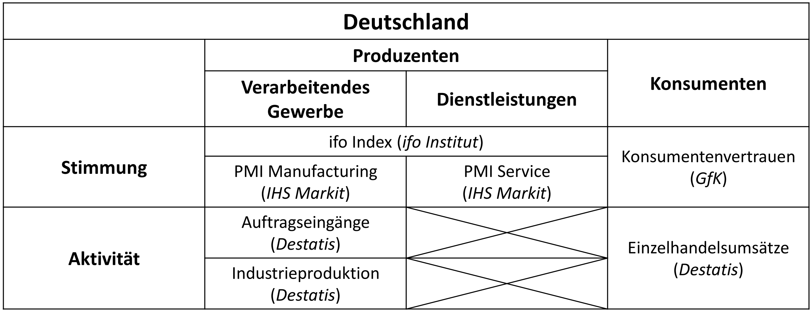
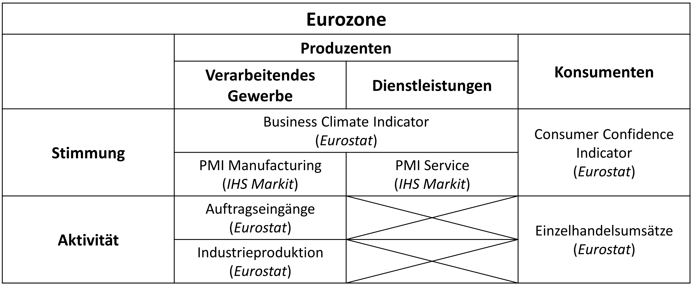
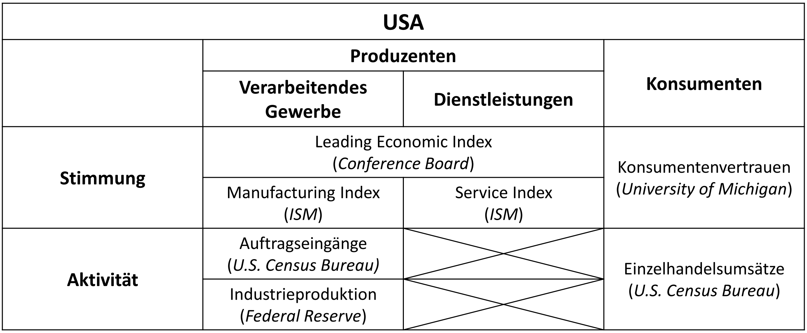

<!--..........................................................................-->
<!--..........................................................................-->

<!-- Include header -->

````{=html}
```{r, echo=FALSE, results='asis'}
xfun::file_string('header_02.html')
```
````
<!--..........................................................................-->
<!--..........................................................................-->

```{r,include=FALSE}

library(knitr)
knitr::opts_chunk$set(
  include = TRUE,
  echo = TRUE,
  warning = FALSE,
  message = FALSE,
  fig.height = 8,
  fig.width = 10,
  fig.align = 'center',
  purl = FALSE)
options(scipen=1)

```

```{r, include=FALSE}

library(curl)

library(magrittr)
library(dplyr)

library(rvest)

```

```{r set-up, include=FALSE}

# Selection code chunks to evaluate ----
ifo.load.01.eval <- FALSE
ifo.load.02.eval <- TRUE

eu.load.01.eval <- FALSE
eu.load.02.eval <- TRUE

ism.load.01.eval <- TRUE

gfk.load.01.eval <- TRUE

```

<!--..........................................................................-->
<!--..........................................................................-->


<!--..........................................................................-->
<hr />

# Konjunkturindikatoren {.tabset .tabset-fade}

<hr />

*Dieses Dokument enthält Veröffentlichungen ausgewählter Stimmungs- und Aktivitätsindikatoren.* 

<hr />

<!--..........................................................................-->
## Einordnung

<!--..........................................................................-->
<hr />

<span style="font-size:20pt;"> Einordnung </span>

<!--..........................................................................-->
<hr />

Für die Einordnung siehe auch Kapitel 2.2 "Vermessung von Wohlstand".

<!--..........................................................................--> 
<button type="button" class="collapsible02"> Deutschland </button>
<div class="col_content">



</div>
<!--..........................................................................--> 

<!--..........................................................................--> 
<button type="button" class="collapsible02"> Eurozone </button>
<div class="col_content">



</div>
<!--..........................................................................--> 

<!--..........................................................................--> 
<button type="button" class="collapsible02"> USA </button>
<div class="col_content">



</div>
<!--..........................................................................--> 

<!--..........................................................................-->
<hr />

<p class="back01">
[Zurück zur *Startseite*](./index.html)
</p>

<!--..........................................................................-->
<hr />


<!--..........................................................................-->
<!-- <hr /> -->

<!--..........................................................................-->
## Vorbereitung {.tabset .tabset-fade}

<!--..........................................................................-->
<hr />

<span style="font-size:20pt;"> Vorbereitung </span>

<!--..........................................................................-->
<hr />

Die Daten werden von unterschiedlichen öffentlich zugänglichen Datenbanken herunterladen.

Die Daten können entweder auf der Website oder über so genannte Programmierschnittstellen (APIs) heruntergeladen werden.

<!--..........................................................................-->
<hr>

<u>Schritt 1</u>: Setze dein Arbeitsverzeichniss

<!--..........................................................................--> 
<button type="button" class="collapsible02"> Arbeitsverzeichniss </button>
<div class="col_content">

```{r, eval=FALSE}

setwd("... insert-you-directory-here ...")

```

</div>
<!--..........................................................................--> 

<u>Schritt 2</u>: Lade Pakete zum Herungeralden der Daten

<!--..........................................................................--> 
<button type="button" class="collapsible02"> Lade Pakete I </button>
<div class="col_content">

```{r}

library(eurostat)
library(fredr)

```

</div>
<!--..........................................................................--> 

<u>Schritt 3</u>: Registriere dich bei *FRED* und fordere eines API Schlüssels an

1) [FRED Konto](https://fredhelp.stlouisfed.org/fred/account/fred-account-features/register/)
2) [API Schlüssel](https://fred.stlouisfed.org/docs/api/api_key.html)

<!--..........................................................................--> 
<button type="button" class="collapsible02"> API Schlüssel </button>
<div class="col_content">

```{r, eval=FALSE}

fredr_set_key("... insert-your-personal-key-here ...")

```

</div>
<!--..........................................................................--> 

<u>Schritt 4</u>: Lade Pakete zur Verarbeitung der heruntergeladenen Daten

<!--..........................................................................--> 
<button type="button" class="collapsible02"> Lade Pakete II </button>
<div class="col_content">

```{r}

library(dplyr)
library(tidyr)
library(ggplot2)
library(scales)
library(zoo)
library(kableExtra)

```

```{r,include=FALSE}

source("../r_set_up.R")

```

</div>
<!--..........................................................................--> 

<u>Schritt 5</u>: Definiere Funktion zur Darstellung der Daten

<!--..........................................................................--> 
<button type="button" class="collapsible02"> Lade Funktion </button>
<div class="col_content">

Funktionen zur Verarbeitung der heruntergeladenen Daten:

```{r}

# See: https://rpubs.com/FSl/609471 (and edited by MM)
add_rec_shade <- function(st_date, ed_date, shade_color = "darkgray", zoo.mon = FALSE, zoo.qtr = FALSE) {
  
  library(fredr)
  library(ecm)
  library(ggplot2)
  library(zoo)
  
  # fredr_set_key("insert_your_api_key")
  # 
  # st_date <- as.Date("2001-06-01")
  # ed_date <- as.Date(Sys.Date())
  
  recession  <-  fredr(series_id = "USRECD",observation_start = as.Date(st_date),observation_end = as.Date(ed_date))
  
  recession$diff <- recession$value-lagpad(recession$value, k = 1)
  recession <- recession[!is.na(recession$diff),]
  recession.start <- recession[recession$diff == 1,]$date
  recession.end <- recession[recession$diff == (-1),]$date
  
  if(length(recession.start) > length(recession.end)) {
    recession.end <- c(recession.end, Sys.Date())
  }
  if(length(recession.end)>length(recession.start)) {
    recession.start <- c(min(recession$date), recession.start)
  }
  
  recs <- as.data.frame(cbind(recession.start, recession.end))
  recs$recession.start <- as.Date(as.numeric(recs$recession.start), origin = as.Date("1970-01-01"))
  
  if(zoo.mon == TRUE){
    recs$recession.start <- as.yearmon(recs$recession.start, "%b%y")
  }
  if(zoo.qtr == TRUE){
    recs$recession.start <- as.yearqtr(recs$recession.start, "%y-Q%q")
  }
  
  recs$recession.end <- as.Date(recs$recession.end, origin = as.Date("1970-01-01"))
  
  if(zoo.mon == TRUE){
    recs$recession.end <- as.yearmon(recs$recession.end, "%b%y")
  }
  if(zoo.qtr == TRUE){
    recs$recession.end <- as.yearqtr(recs$recession.end, "%y-Q%q")
  }
  
  if(nrow(recs) > 0) {
    rec_shade <- geom_rect(data = recs, inherit.aes = FALSE, 
                           aes(xmin = recession.start, xmax = recession.end, ymin = -Inf, ymax = +Inf), 
                           fill = shade_color, alpha = 0.5)
    
    return(rec_shade)
  }
  
}

```

</div>
<!--..........................................................................--> 

<u>Schritt 6</u>: Definiere Grafikvorlage zur Darstellung der Daten

<!--..........................................................................--> 
<button type="button" class="collapsible02"> Lade Grafikvorlage </button>
<div class="col_content">

Grafikvorlage für *ggplot*:

```{r}

mod.theme.01 <- theme_gray() + theme(axis.text.x = element_text(angle = 90, vjust = 0.5, size = 12),
                                     axis.text.y = element_text(size = 12),
                                     plot.title = element_text(size = 16),
                                     plot.subtitle = element_text(size = 12),
                                     plot.caption = element_text(size = 12),
                                     legend.text = element_text(size = 12))

mod.theme.01$legend.position <- c("bottom")

```

</div>
<!--..........................................................................--> 

<!--..........................................................................-->
<hr />

<p class="back01">
[Zurück zur *Startseite*](./index.html)
</p>

<!--..........................................................................-->
<hr />


<!--..........................................................................-->
<!-- <hr /> -->

<!--..........................................................................-->
## Simmung {.tabset .tabset-fade}

<!--..........................................................................-->
<hr />

<span style="font-size:20pt;"> Simmung </span>

<!--..........................................................................-->
<hr />

<!--..........................................................................-->
### Produzenten {.tabset .tabset-fade}

<!--..........................................................................-->
<hr />

<span style="font-size:20pt;"> Produzenten </span>

<!--..........................................................................-->
<hr />

<!--..........................................................................-->
#### Ifo Geschäftsklima

<!--..........................................................................-->
<hr />

<span style="text-decoration:underline; font-size:20pt;">Ifo Geschäftsklima Index</span>

<!--..........................................................................-->
<hr />

<p class="head01">
Überblick
</p>

* Einordnung: Produzenten, generell
* Region: Deutschland
* Herausgeber: Ifo-Institut ([siehe](https://www.ifo.de/umfrage/ifo-geschaeftsklimaindex))

<!--..........................................................................-->
<hr />

<p class="head01">
Weitere Informationen
</p>

Der Ifo Geschäftsklima Index ist eine der wichtigsten Messzahlen um die Stimmung in der "realen" Wirtschaft darzustellen.

Dem gegenüber steht der ZEW-Index für die Abbildung der Stimmung auf den Finanzmärkten. 

<!--..........................................................................-->
<hr />

<p class="head01">
Ergebnisse
</p>

```{r, include=FALSE}

if(ifo.load.01.eval) {
  
  # setwd("C:/Users/Markus/Dropbox/Lehre/HfWU/Makrooekonomik2/Makrooekonomik2_Allgemein/HfWU_Makro02_Html")

  ifo_load_fun <- function(per.01){
    
    # # inputs
    # per.01 <- c("202207")
    # # per.01 <- per.vec[ii]
    
    per.sub.01 <- substring(per.01, first = 1, last = 4)
    per.sub.02 <- substring(per.01, first = 5, last = 6)
    
    per.02 <- paste0(substr(per.01, start = 1, stop = 4), "-", substr(per.01, start = 5, stop = 6) )
    
    # url <- paste0("https://www.ifo.de/sites/default/files/secure/umfragen-gsk/ku-",per.01,"/ku-",per.02,"-pm-geschaeftsklima-DT.pdf")
    # url <- paste0("https://www.ifo.de/sites/default/files/",per.02,"/ku-",per.02,"-pm-geschaeftsklima-DT_3.pdf")
    # url <- paste0("https://www.ifo.de/sites/default/files/2022-06/ku-2022-06-pm-geschaeftsklima-DT_3.pdf")
    url <- paste0("https://www.ifo.de/sites/default/files/secure/umfragen-gsk/ku-",per.01,"/ku-",per.02,"-pm-geschaeftsklima-DT.pdf") # update: 25.10.2022
    
    # print(url)
    destfile <- paste0("./reports/ifo_index.pdf")
    # print(destfile)
    
    curl::curl_download(url, destfile)
  
  }
  
  year <- "2023"
  per.vec <- paste(year,sprintf("%02d", 1:12),sep = "")
  
  ii <- 12
  while(ii != 0) {
    
    continue <- FALSE
    tryCatch( ifo_load_fun(per.vec[ii]),
              error = function(e) { continue <<- TRUE } )
    if(continue==TRUE){
      ii <- ii - 1
    } else {
      # stop(paste0("current month:",ii))
      break
    }
  
  }
  
  paste0("current month: ",ii)
  
}

if(ifo.load.02.eval) {
  
  ifo_scrap_fun <- function(destfile = c("./reports/ifo_index.pdf")) {
  
    # destfile = c("./reports/ifo_index.pdf")
    
    #..................................................
    # 1st web scrapping
    url.01 <- read_html("https://www.ifo.de/umfrage/ifo-geschaeftsklima-deutschland")
    class(url.01)
    
    #..................................................
    # 1st a-href's
    a.href.01 <- url.01 %>%
      html_elements("a") %>%
      html_attr("href")
    
    ii <- grep(c("fakten"), a.href.01)[1] # finds the first links to /fakten
    a.href.01[ii] # check
    
    #..................................................
    # 2nd web scrapping
    # paste(c("https://www.ifo.de"), lin[ii], sep = "")
    
    url.02 <- paste(c("https://www.ifo.de"), a.href.01[ii], sep = "") %>%
      read_html()
    
    # c("https://www.ifo.de/fakten/2022-10-25/ifo-geschaeftsklima-weiter-schlecht-oktober-2022")
    
    #..................................................
    # 2nd a-href's
    a.href.02 <- url.02 %>%
      html_elements("a") %>%
      html_attr("href")
    
    a.href.02
    
    ii <- grep(c("pdf"), a.href.02)[1] # finds the first links to .pdf
    a.href.02[ii] # check
    
    # destfile <- c("ifo.pdf")
    
    # download report
    paste(c("https://www.ifo.de"), a.href.02[ii], sep = "") %>% 
      curl::curl_download(destfile)
  
  }

  ifo_scrap_fun()
  
}

```

<!--..........................................................................--> 
<button type="button" class="collapsible02"> Aktuelle Veröffentlichung </button>
<div class="col_content">

<center>
<embed src="Pdfs/ifo_index.pdf" width="900" height="1000" type="application/pdf">
</center>

<br>

<p class="sou01">
Quelle: Ifo Institut
</p>

<br>

</div>
<!--..........................................................................--> 

<!--..........................................................................-->
<hr />

<p class="back01">
[Zurück zur *Startseite*](./index.html)
</p>

<!--..........................................................................-->
<hr />


<!--..........................................................................-->
<!-- <hr /> -->

<!--..........................................................................-->
#### EU Sentiment

<!--..........................................................................-->
<hr />

<span style="text-decoration:underline; font-size:20pt;">EU Sentiment</span>

<!--..........................................................................-->
<hr />

<p class="head01">
Überblick
</p>

* Einordnung: Produzenten (generell) und Konsumenten
* Region: EU und Eurozone
* Herausgeber: Europäische Kommission ([siehe](https://ec.europa.eu/info/business-economy-euro/indicators-statistics/economic-databases/business-and-consumer-surveys/download-business-and-consumer-survey-data/press-releases_de))

<!--..........................................................................-->
<hr />

<p class="head01">
Weitere Informationen
</p>

Die Stimmungsindikatoren von der Europäischen Kommission sind eine der wichtigsten Messzahlen um die Stimmung in der "realen" Wirtschaft in der EU und der Eurozone darzustellen.

Die Stimmung in der gesamten Wirtschaft (Produzenten und Konsumenten) wird durch das "Wirtschaftsvertrauen" ("Economic Sentiment") dargestellt.

Ein wichtiger Teil des generellen "Wirtschaftsvertrauens" ist das "Konsumentenvertrauen" ("Consumer Confidence") das auch als eigene Veröffentlichung eine Woche vor der Veröffentlichung des generellen "Wirtschaftsvertauens" als vorläufige Schätzung veröffentlicht wird.

Außerdem wird als weiterer Teil des generellen "Wirtschaftsvertrauens" im Rahmen des "Unternehmensvertrauens" ("Business Confidence") die Stimmung in den verschiedenen Sektoren auf Seiten der Produzenten erhoben.

<!--..........................................................................-->
<hr />

<p class="head01">
Ergebnisse
</p>

```{r, include=FALSE}

if(eu.load.01.eval) {
  
  # setwd("C:/Users/Markus/Dropbox/Lehre/HfWU/Makrooekonomik2/Makrooekonomik2_Allgemein/HfWU_Makro02_Html")

  eu_load_fun <- function(per.01){
  
    # # inputs
    # per.01 <- c("202203")
    # per.01 <- per.vec[ii]
    
    
    
    per.01 <- paste0(substr(per.01, start = 1, stop = 4), "_", substr(per.01, start = 5, stop = 6) )
    
    url <- paste0("https://ec.europa.eu/info/sites/default/files/bcs_",per.01,"_en.pdf")
    # print(url)
    destfile <- paste0("./reports/eu_sentiment.pdf")
    # print(destfile)
    
    curl::curl_download(url, destfile)
  
  }
  
  year <- "2023"
  per.vec <- paste(year,sprintf("%02d", 1:12),sep = "")
  
  ii <- 12
  # while(ii != 0) {
  #   
  #   continue <- FALSE
  #   tryCatch( eu_load_fun(per.vec[ii]),
  #             error = function(e) { continue <<- TRUE })
  #   if(continue==TRUE){
  #     ii <- ii - 1
  #   } else {
  #     # stop(paste0("current month:",ii))
  #     break
  #   }
  # 
  # }
  
  paste0("current month: ",ii)
  
  # 25.10.2022: THIS IS NOT WORKING ANYMORE!
  
  # USE_MANUAL
  
  # Link: 

}

if(eu.load.02.eval) {
  
  eu_scrap_fun <- function(destfile = "./reports/eu_sentiment.pdf", year = 2023) {
  
    # library(rvest)
    
    #..................................................
    # 1st web scrapping
    url.01 <- read_html("https://economy-finance.ec.europa.eu/economic-forecast-and-surveys/business-and-consumer-surveys/download-business-and-consumer-survey-data/press-releases_en")
    class(url.01)
    
    #..................................................
    # 1st a-href's
    a.href.01 <- url.01 %>%
      html_elements("a") %>%
      html_attr("href")
    
    a.href.01
    # filename=bcs_2022_10_en.pdf
    
    
    # year <- "2023"
    per.vec <- paste("filename=bcs", year, sprintf("%02d", 1:12), "en", sep = "_")
    per.vec
    
    lin.vec.01 <- rep(NA, 12)
    for (ii in 1:12) {
      
      jj <- grep(per.vec[ii], a.href.01)[1]
      lin.vec.01[ii] <- a.href.01[jj]
      
    }
    
    lin.vec.01
    lin.vec.02 <- lin.vec.01[!is.na(lin.vec.01)]
    lin.vec.02
    
    lin.vec <- lin.vec.02[length(lin.vec.02)] # the current release is at the bottom
    
    # destfile <- c("./reports/eu_sentiment.pdf")
    
    # download report
    paste(c("https://economy-finance.ec.europa.eu"), lin.vec, sep = "") %>% 
      curl::curl_download(destfile)
  
  }

  eu_scrap_fun()
  
}

```

<!--..........................................................................--> 
<button type="button" class="collapsible02"> Aktuelle Veröffentlichung </button>
<div class="col_content">

<center>
<embed src="Pdfs/eu_sentiment.pdf" width="900" height="1000" type="application/pdf">
</center>

<br>

<p class="sou01">
Quelle: Europäische Kommission
</p>

<br>

</div>
<!--..........................................................................--> 

<!--..........................................................................-->
<hr />

<p class="back01">
[Zurück zur *Startseite*](./index.html)
</p>

<!--..........................................................................-->
<hr />


<!--..........................................................................-->
<!-- <hr /> -->

<!--..........................................................................-->
#### ISM PMIs (USA)

<!--..........................................................................-->
<hr />

<span style="text-decoration:underline; font-size:20pt;">ISM: PMIs</span>

<!--..........................................................................-->
<hr />

<p class="head01">
Überblick
</p>

* Einordnung: Anbieter, veratbeitendes Gewerbe und Dienstleistungen
* Region: USA
* Herausgeber: Institute for Supply Management (ISM) ([siehe](https://www.ismworld.org/supply-management-news-and-reports/reports/ism-report-on-business/))

<!--..........................................................................-->
<hr />

<p class="head01">
Weitere Informationen
</p>

Die Einkaufsmanagerindizes vom Instiute for Supply Management sind neben den offiziellen Umfragen eine der wichtigsten Messzahlen um die Stimmung bei den Anbietern in den USA abzubilden.

Dazu gibt es zwei Umfragen, eine im verarbeitenden Gewerbe sowie eine im Dienstleistungssektor.

<!--..........................................................................-->
<hr />

<p class="head01">
Ergebnisse
</p>

```{r, include=FALSE}

if(ism.load.01.eval) {
  
  # setwd("C:/Users/Markus/Dropbox/Lehre/HfWU/Makrooekonomik2/Makrooekonomik2_Allgemein/HfWU_Makro02_Html")

  # Manufacturing
  ism_man_load_fun <- function(per.01){
    
    # per.01 <- c("202205")
  
    
    
    url <- paste0("https://www.ismworld.org/globalassets/pub/research-and-surveys/rob/pmi/rob",per.01,"pmi.pdf")
  
    # print(url)
    destfile <- paste0("./reports/ism_man_index.pdf")
    # print(destfile)
    
    curl::curl_download(url, destfile)
  
  }
  
  year <- "2023"
  per.vec <- paste(year,sprintf("%02d", 1:12),sep = "")
  
  ii <- 12
  while(ii != 0) {
    
    continue <- FALSE
    tryCatch( ism_man_load_fun(per.vec[ii]),
              error = function(e) { continue <<- TRUE })
    if(continue==TRUE){
      ii <- ii - 1
    } else {
      # stop(paste0("current month:",ii))
      break
    }
  
  }
  
  paste0("current month:",ii)
  
  # Service
  ism_ser_load_fun <- function(per.01){
    
    # per.01 <- c("202205")
  
    
    
    url <- paste0("https://www.ismworld.org/globalassets/pub/research-and-surveys/rob/nmi/rob",per.01,"svcs.pdf")
    
    # print(url)
    destfile <- paste0("./reports/ism_ser_index.pdf")
    # print(destfile)
    
    curl::curl_download(url, destfile)
  
  }
  
  year <- "2023"
  per.vec <- paste(year,sprintf("%02d", 1:12),sep = "")
  
  ii <- 12
  while(ii != 0) {
    
    continue <- FALSE
    tryCatch( ism_ser_load_fun(per.vec[ii]),
              error = function(e) { continue <<- TRUE })
    if(continue==TRUE){
      ii <- ii - 1
    } else {
      # stop(paste0("current month:",ii))
      break
    }
  
  }
  
  paste0("current month:",ii)

}

```

<!--..........................................................................--> 
<button type="button" class="collapsible02"> Aktuelle Veröffentlichung: Verarbeitendes Gewerbe </button>
<div class="col_content">

<center>
<embed src="Pdfs/ism_man_index.pdf" width="900" height="1000" type="application/pdf">
</center>

<br>

<p class="sou01">
Quelle: ISM Institut
</p>

<br>

</div>
<!--..........................................................................--> 

<!--..........................................................................--> 
<button type="button" class="collapsible02"> Aktuelle Veröffentlichung: Dienstleistungssektor </button>
<div class="col_content">

<center>
<embed src="Pdfs/ism_ser_index.pdf" width="900" height="1000" type="application/pdf">
</center>

<br>

<p class="sou01">
Quelle: ISM Institut
</p>

<br>

</div>
<!--..........................................................................--> 

<!--..........................................................................-->
<hr />

<p class="back01">
[Zurück zur *Startseite*](./index.html)
</p>

<!--..........................................................................-->
<hr />


<!--..........................................................................-->
<!-- <hr /> -->

<!--..........................................................................-->
### Konsumenten {.tabset .tabset-fade}

<!--..........................................................................-->
<hr />

<span style="font-size:20pt;"> Konsumenten </span>

<!--..........................................................................-->
<hr />

<!--..........................................................................-->
#### GfK Konsumklima

<!--..........................................................................-->
<hr />

<span style="text-decoration:underline; font-size:20pt;">GfK Konsumklima</span>

<!--..........................................................................-->
<hr />

<p class="head01">
Überblick
</p>

* Einordnung: Konsumenten
* Region: Deutschland
* Herausgeber: GfK ([siehe](https://www.gfk.com/de/home))

<!--..........................................................................-->
<hr />

<p class="head01">
Weitere Informationen
</p>

Das GfK Konsumentenvertrauen ist eine der wichtigsten Messzahlen um die Simmung bei den Konsumenten in Deutschland darzustellen.

<!--..........................................................................-->
<hr />

<p class="head01">
Ergebnisse
</p>

```{r, include=FALSE}

if(gfk.load.01.eval) {
  
  # setwd("C:/Users/Markus/Dropbox/Lehre/HfWU/Makrooekonomik2/Makrooekonomik2_Allgemein/HfWU_Makro02_Html")

  gfk_load_fun <- function(per.01){
    
    # inputs
    # per.01 <- c("20220628")
    # per.01 <- per.vec[ii]
    
    
    
    # per.02 <- paste0(substr(per.01, start = 1, stop = 4), "-", substr(per.01, start = 5, stop = 6) )
    
    url <- paste0("https://www.gfk.com/hubfs/website/editorial_ui_pdfs/",per.01,"_PM_Konsumklima_Deutschland_dfin.pdf")
    # print(url)
    destfile <- paste0("./reports/gfk_index.pdf")
    # print(destfile)
    
    curl::curl_download(url, destfile)
  
  }

  year <- "2023"
  per.vec <- paste(year,sprintf("%02d", 1:12),sep = "")
  day <- c("20","21","22","23","24","25","26","27","28","29","30","31")
  
  tmp <- expand.grid(day,per.vec)
  per.vec <- paste(tmp[,2],tmp[,1],sep="")
  per.vec
  
  ii <- 144
  while(ii != 0) {
    
    continue <- FALSE
    tryCatch( gfk_load_fun(per.vec[ii]),
              error = function(e) { continue <<- TRUE })
    if(continue==TRUE){
      ii <- ii - 1
    } else {
      # stop(paste0("current month:",ii))
      break
    }
  
  }
  
  paste0("current month:",ii)

}

```

<!--..........................................................................--> 
<button type="button" class="collapsible02"> Aktuelle Veröffentlichung </button>
<div class="col_content">

<center>
<embed src="Pdfs/gfk_index.pdf" width="900" height="1000" type="application/pdf">
</center>

<br>

<p class="sou01">
Quelle: GfK
</p>

<br>

</div>
<!--..........................................................................--> 

<!--..........................................................................-->
<hr />

<p class="back01">
[Zurück zur *Startseite*](./index.html)
</p>

<!--..........................................................................-->
<hr />


<!--..........................................................................-->
<!-- <hr /> -->

<!--..........................................................................-->
#### UoM Consumer Confidence

<!--..........................................................................-->
<hr />

<span style="text-decoration:underline; font-size:20pt;">UoM Consumer Confidence</span>

<!--..........................................................................-->
<hr />

<p class="head01">
Überblick
</p>

* Einordnung: Konsumenten
* Region: USA
* Herausgeber: University of Michigan ([siehe](https://data.sca.isr.umich.edu/))

<!--..........................................................................-->
<hr />

<p class="head01">
Weitere Informationen
</p>

Das UoM Konsumentenvertrauen ist eine der wichtigsten Messzahlen um die Stimmung bei den Konsumenten in den USA darzustellen.

<!--..........................................................................-->
<hr />

<p class="head01">
Ergebnisse
</p>

<!--..........................................................................-->
<button type="button" class="collapsible01"> *Show Code* </button>
<div class="cod_content">
```{r,results=FALSE,fig.show='hide',eval=FALSE}

# Meta data
met.dat <- fredr_series_search_text("UMCSENT")

# Data
ser.dat <- fredr_series_observations(series_id = met.dat$id[1],
                                     observation_start = as.Date("2000-01-01"),
                                     units = "lin")
# Transform date to yearmon class
ser.dat$date.zoo <- as.yearmon(ser.dat$date, "%b%y")

# Construct plot
plot <- ggplot(data = ser.dat, mapping = aes(x = date.zoo, y = value,color = series_id)) +
  add_rec_shade(min(ser.dat$date), max(ser.dat$date), zoo.mon = TRUE, zoo.qtr = FALSE) +
  geom_line(color = "black", size = 1) +
  scale_y_continuous(name = "Index (1966-Q1=100)", labels = comma) +
  scale_x_yearmon(breaks=seq(from = min(ser.dat$date.zoo), to = max(ser.dat$date.zoo), by = 1),
                  minor_breaks = seq(from = min(ser.dat$date.zoo), to = max(ser.dat$date.zoo), by = 1),
                  format = "%b %y",
                  expand = c(0, 0)) +
  labs(title = met.dat$title[1],
       subtitle = paste0(c("(Letzter Beobachtungswert: "), as.yearmon(as.Date(met.dat$observation_end)), c(")")),
       caption = "Quelle: University of Michigan", 
       x = "", y = "Index (1966-Q1=100)") +
  mod.theme.01


# Return plot
plot

```
</div>
<!--..........................................................................-->
<button type="button" class="collapsible01"> *Show Output* </button>
<div class="cod_content">
```{r,echo=FALSE}

# Meta data
met.dat <- fredr_series_search_text("UMCSENT")

# Data
ser.dat <- fredr_series_observations(series_id = met.dat$id[1],
                                     observation_start = as.Date("2000-01-01"),
                                     units = "lin")
# Transform date to yearmon class
ser.dat$date.zoo <- as.yearmon(ser.dat$date, "%b%y")

# Construct plot
plot <- ggplot(data = ser.dat, mapping = aes(x = date.zoo, y = value,color = series_id)) +
  add_rec_shade(min(ser.dat$date), max(ser.dat$date), zoo.mon = TRUE, zoo.qtr = FALSE) +
  geom_line(color = "black", size = 1) +
  scale_y_continuous(name = "Index (1966-Q1=100)", labels = comma) +
  scale_x_yearmon(breaks=seq(from = min(ser.dat$date.zoo), to = max(ser.dat$date.zoo), by = 1),
                  minor_breaks = seq(from = min(ser.dat$date.zoo), to = max(ser.dat$date.zoo), by = 1),
                  format = "%b %y",
                  expand = c(0, 0)) +
  labs(title = met.dat$title[1],
       subtitle = paste0(c("(Letzter Beobachtungswert: "), as.yearmon(as.Date(met.dat$observation_end)), c(")")),
       caption = "Quelle: University of Michigan", 
       x = "", y = "Index (1966-Q1=100)") +
  mod.theme.01


# Return plot
plot

```

</div>
<!--..........................................................................-->

<!--..........................................................................-->
<button type="button" class="collapsible01"> *Letzte Werte* </button>
<div class="col_content">
```{r, echo=FALSE, results=TRUE}

tab <- cbind(tail(ser.dat[,c(1,3)]))

colnames(tab) <- c("Datum", "Wert")

tab$Datum <- as.yearmon(as.Date(tab$Datum))

tab %>%
  kbl(format.args = list(decimal.mark = ',', big.mark = ".")) %>%
  kable_styling()

```
</div>
<!--..........................................................................-->


```{r,include=FALSE,purl=TRUE}

# Save plot
ggsave(plot = plot, width = 8, height = 6, dpi = 300, filename = "./Figures/UMCSENT_lev.pdf")
ggsave(plot = plot, width = 8, height = 6, dpi = 300, filename = "./Figures/UMCSENT_lev.svg")

```

<!--..........................................................................-->
<hr />

<p class="back01">
[Zurück zur *Startseite*](./index.html)
</p>

<!--..........................................................................-->
<hr />


<!--..........................................................................-->
<!-- <hr /> -->

<!--..........................................................................-->
## Aktivität {.tabset .tabset-fade}

<!--..........................................................................-->
<hr />

<span style="font-size:20pt;"> Aktivität </span>

<!--..........................................................................-->
<hr />

<!--..........................................................................-->
### Produzenten {.tabset .tabset-fade}

<!--..........................................................................-->
<hr />

<span style="font-size:20pt;"> Produzenten </span>

<!--..........................................................................-->
<hr />

<!--..........................................................................-->
#### EU Industrieproduktion

<!--..........................................................................-->
<!-- <hr /> -->

<!-- <span style="font-size:20pt;"> Industrieproduktion </span> -->

<!--..........................................................................-->
<hr />

<span style="text-decoration:underline; font-size:18pt;"> Überblick </span>

* Einordnung: Produzenten, verarbeitendes Gewerbe
* Region: EU Mitgliedstaaten
* Herausgeber: Eurostat ([siehe](https://ec.europa.eu/eurostat/de/home))
* Bereinigung: Saison-, Kalender- und Preisbereinigung

<!--..........................................................................-->
<hr />

<span style="text-decoration:underline; font-size:18pt;"> Werte </span>

<!--..........................................................................-->
<button type="button" class="collapsible01"> *Show Code* </button>
<div class="cod_content">
```{r,results=FALSE,fig.show='hide',eval=FALSE, eval=FALSE}

# Data
ser.dat <- get_eurostat(id = "sts_inpr_m",
                        filters = list(precision = c(1),
                                       geo = c("DE","FR","EA19"),
                                       unit = c("I15"),
                                       s_adj = c("SCA"),
                                       indic_bt = c("PROD"), # volume index of production
                                       sinceTimePeriod = c("2015M01"),
                                       nace_r2 = c("B-D")))

# Transform date to yearmon class
ser.dat$date.zoo <- as.yearmon(ser.dat$time, "%b%y")

# Construct plot
plot <- ggplot(data = ser.dat, mapping = aes(x = date.zoo, y = values, color = geo)) +
  geom_line(size = 1) +
  scale_x_yearmon(breaks = seq(from = min(ser.dat$date.zoo), to = max(ser.dat$date.zoo), by = 3/12),
                  minor_breaks = seq(from = min(ser.dat$date.zoo), to = max(ser.dat$date.zoo), by = 1/12),
                  format = "%b %y",
                  expand = c(0, 0)) +
  scale_y_continuous(breaks = seq(0, 200, 5)) + 
  scale_color_discrete(name = "", labels = c("DEU","EURO-19","FRA")) +
  labs(title = "Industrieproduktion (saison- und kalenderbereinigt)",
       subtitle = paste0(c("(Letzter Beobachtungswert: "), as.yearmon(as.Date(ser.dat$time[length(ser.dat$time)])), c(")")),
       caption = "Quelle: Eurostat", 
       x = "", y = "Mengenindex (2015=100)") +
  mod.theme.01

# Return plot
plot

```
</div>
<!--..........................................................................-->
<button type="button" class="collapsible01"> *Show Output* </button>
<div class="cod_content">
```{r,echo=FALSE, eval=FALSE}

# Data
ser.dat <- get_eurostat(id = "sts_inpr_m",
                        filters = list(precision = c(1),
                                       geo = c("DE","FR","EA19"),
                                       unit = c("I15"),
                                       s_adj = c("SCA"),
                                       indic_bt = c("PROD"), # volume index of production
                                       sinceTimePeriod = c("2015M01"),
                                       nace_r2 = c("B-D")))

# Transform date to yearmon class
ser.dat$date.zoo <- as.yearmon(ser.dat$time, "%b%y")

# Construct plot
plot <- ggplot(data = ser.dat, mapping = aes(x = date.zoo, y = values, color = geo)) +
  geom_line(size = 1) +
  scale_x_yearmon(breaks = seq(from = min(ser.dat$date.zoo), to = max(ser.dat$date.zoo), by = 3/12),
                  minor_breaks = seq(from = min(ser.dat$date.zoo), to = max(ser.dat$date.zoo), by = 1/12),
                  format = "%b %y",
                  expand = c(0, 0)) +
  scale_y_continuous(breaks = seq(0, 200, 5)) + 
  scale_color_discrete(name = "", labels = c("DEU","EURO-19","FRA")) +
  labs(title = "Industrieproduktion (saison- und kalenderbereinigt)",
       subtitle = paste0(c("(Letzter Beobachtungswert: "), as.yearmon(as.Date(ser.dat$time[length(ser.dat$time)])), c(")")),
       caption = "Quelle: Eurostat", 
       x = "", y = "Mengenindex (2015=100)") +
  mod.theme.01

# Return plot
plot

```

</div>
<!--..........................................................................-->

<!--..........................................................................-->
<button type="button" class="collapsible01"> *Letzte Werte* </button>
<div class="col_content">
```{r, echo=FALSE, results=TRUE, eval=FALSE}

tab <- cbind(tail(ser.dat[ser.dat$geo %in% c("DE"),c(6,7)],10),
             tail(ser.dat[ser.dat$geo %in% c("FR"),c(7)],10),
             tail(ser.dat[ser.dat$geo %in% c("EA19"),c(7)],10))

colnames(tab) <- c("Zeitraum", "DEU", "FRA", "EURO-19")

tab$Zeitraum <- as.yearmon(as.Date(tab$Zeitraum))

tab %>%
  kbl(format.args = list(decimal.mark = ',', big.mark = ".")) %>%
  kable_styling()

```
</div>
<!--..........................................................................-->

```{r,include=FALSE, eval=FALSE}

# Save plot
ggsave(plot=plot, width=8, height=6, dpi=300, filename = "./Figures/EU_INDPRO_lev.pdf")

```


```{r}

type <- c("code")
stringsAsFactors <- FALSE

url <- "https://ec.europa.eu/eurostat/api/dissemination/statistics/1.0/data/sts_inpr_m?format=JSON&geo=DE&geo=FR&geo=EA19&freq=M&unit=I15&s_adj=SCA&indic_bt=PROD&nace_r2=B-D"
url

resp <- httr::RETRY("GET", url, terminate_on = c(404))

jdat <- jsonlite::fromJSON(url)

dims <- jdat$dimension
ids <- jdat$id
dims_list <- lapply(dims[rev(ids)], function(x) {
  y <- x$category$label
  if (type[1] == "label") {
    y <- unlist(y, use.names = FALSE)
  } else if (type[1] == "code") {
    y <- names(unlist(y))
  } else if (type[1] == "both") {
    y <- unlist(y)
  } else {
    stop("Invalid type ", type)
  }
})
variables <- expand.grid(dims_list, KEEP.OUT.ATTRS = FALSE, stringsAsFactors = stringsAsFactors)
dat <- as.data.frame(variables[rev(names(variables))])
vals <- unlist(jdat$value, use.names = FALSE)
dat$values <- rep(NA, nrow(dat))
inds <- 1 + as.numeric(names(jdat$value))

dat$values[inds] <- vals
data <- tibble::as_tibble(dat)
data


data$time <- as.Date(as.yearmon(data$time))

ser.dat <- subset(data, time %in% seq(as.Date("2015-01-01"), Sys.Date(), by = "month"))
head(ser.dat)


# Transform date to yearmon class
ser.dat$date.zoo <- as.yearmon(ser.dat$time, "%b%y")

# Construct plot
plot <- ggplot(data = ser.dat, mapping = aes(x = date.zoo, y = values, color = geo)) +
  geom_line(size = 1) +
  scale_x_yearmon(breaks = seq(from = min(ser.dat$date.zoo), to = max(ser.dat$date.zoo), by = 3/12),
                  minor_breaks = seq(from = min(ser.dat$date.zoo), to = max(ser.dat$date.zoo), by = 1/12),
                  format = "%b %y",
                  expand = c(0, 0)) +
  scale_y_continuous(breaks = seq(0, 200, 5)) + 
  scale_color_discrete(name = "", labels = c("DEU","EURO-19","FRA")) +
  labs(title = "Industrieproduktion (saison- und kalenderbereinigt)",
       subtitle = paste0(c("(Letzter Beobachtungswert: "), as.yearmon(as.Date(ser.dat$time[length(ser.dat$time)])), c(")")),
       caption = "Quelle: Eurostat", 
       x = "", y = "Mengenindex (2015=100)") +
  mod.theme.01

# Return plot
plot

ggsave(plot=plot, width=8, height=6, dpi=300, filename = "./Figures/EU_INDPRO_lev.svg")

```


<!--..........................................................................-->
<hr />

<p class="back01">
[Zurück zur *Startseite*](./index.html)
</p>

<!--..........................................................................-->
<hr />


<!--..........................................................................-->
<!-- <hr /> -->

<!--..........................................................................-->
#### US Industrieproduktion

<!--..........................................................................-->
<hr />

<span style="text-decoration:underline; font-size:20pt;">USA Industrieproduktion</span>

<!--..........................................................................-->
<hr />

<p class="head01">
Überblick
</p>

* Einordnung: Produzenten
* Region: USA
* Herausgeber: Board of Governors of the Federal Reserve System ([siehe](https://www.federalreserve.gov/releases/g17/current/default.htm))
* Bereinigung: Saison- und Preisbereinigung, keine Kalenderbereingung

<!--..........................................................................-->
<hr />

<p class="head01">
Weitere Informationen
</p>

Die Industrieproduktion ist die wichtigste Messzahl um die Aktivität bei den Produzenten darzustellen.

<!--..........................................................................-->
<hr />

<p class="head01">
Ergebnisse
</p>

<!--..........................................................................-->
<button type="button" class="collapsible01"> *Show Code* </button>
<div class="cod_content">
```{r,results=FALSE,fig.show='hide',eval=FALSE}

# Meta data
met.dat <- fredr_series_search_text("INDPRO")

# Data
ser.dat <- fredr_series_observations(series_id = met.dat$id[1],
                                     observation_start = as.Date("2000-01-01"),
                                     units = "lin")

# Transform date to yearmon class
ser.dat$date.zoo <- as.yearmon(ser.dat$date, "%b%y")

# Construct plot
plot <- ggplot(data = ser.dat, mapping = aes(x = date.zoo, y = value, color = series_id)) +
  add_rec_shade(min(ser.dat$date), max(ser.dat$date), zoo.mon = TRUE, zoo.qtr = FALSE) +
  geom_line(color = "black", size = 1) +
  scale_x_yearmon(breaks = seq(from = min(ser.dat$date.zoo), to = max(ser.dat$date.zoo), by = 1),
                  minor_breaks = seq(from = min(ser.dat$date.zoo), to = max(ser.dat$date.zoo), by = 1),
                  format = "%b %y",
                  expand = c(0, 0)) +
  labs(title = "Industrieproduktion (saisonbereinigt)",
       subtitle = paste0(c("(Letzter Beobachtungswert: "), as.yearmon(as.Date(met.dat$observation_end)), c(")")),
       caption = "Quelle: Board of Governors of the Federal Reserve System", 
       x = "", y = "Mengenindex (2017=100)") +
  mod.theme.01

# Return plot
plot

```
</div>
<!--..........................................................................-->
<button type="button" class="collapsible01"> *Show Output* </button>
<div class="cod_content">
```{r,echo=FALSE}

# Meta data
met.dat <- fredr_series_search_text("INDPRO")

# Data
ser.dat <- fredr_series_observations(series_id = met.dat$id[1],
                                     observation_start = as.Date("2000-01-01"),
                                     units = "lin")

# Transform date to yearmon class
ser.dat$date.zoo <- as.yearmon(ser.dat$date, "%b%y")

# Construct plot
plot <- ggplot(data = ser.dat, mapping = aes(x = date.zoo, y = value, color = series_id)) +
  add_rec_shade(min(ser.dat$date), max(ser.dat$date), zoo.mon = TRUE, zoo.qtr = FALSE) +
  geom_line(color = "black", size = 1) +
  scale_x_yearmon(breaks = seq(from = min(ser.dat$date.zoo), to = max(ser.dat$date.zoo), by = 2),
                  minor_breaks = seq(from = min(ser.dat$date.zoo), to = max(ser.dat$date.zoo), by = 1),
                  format = "%b %y",
                  expand = c(0, 0)) +
  labs(title = "Industrieproduktion (saisonbereinigt)",
       subtitle = paste0(c("(Letzter Beobachtungswert: "), as.yearmon(as.Date(met.dat$observation_end)), c(")")),
       caption = "Quelle: Board of Governors of the Federal Reserve System", 
       x = "", y = "Mengenindex (2017=100)") +
  mod.theme.01

# Return plot
plot

```

</div>
<!--..........................................................................-->

<!--..........................................................................-->
<button type="button" class="collapsible01"> *Letzte Werte* </button>
<div class="col_content">
```{r, echo=FALSE, results=TRUE}

tab <- tail(ser.dat,10)[,c(1,3)]
colnames(tab) <- c("Zeitraum", "Wert")

tab$Zeitraum <- as.yearmon(as.Date(tab$Zeitraum))

tab$Wert <- round(tab$Wert, 2)

tab %>%
  kbl(format.args = list(decimal.mark = ',', big.mark = ".")) %>%
  kable_styling()

```
</div>
<!--..........................................................................-->

```{r,include=FALSE,purl=TRUE}

# Save plot
ggsave(plot = plot, width = 8, height = 6, dpi = 300, filename = "./Figures/US_INDPRO_lev.pdf")
ggsave(plot = plot, width = 8, height = 6, dpi = 300, filename = "./Figures/US_INDPRO_lev.svg")

```

<!--..........................................................................-->
<hr />

<p class="back01">
[Zurück zur *Startseite*](./index.html)
</p>

<!--..........................................................................-->
<hr />


<!--..........................................................................-->
<!-- <hr /> -->

<!--..........................................................................-->
### Konsumenten {.tabset .tabset-fade}

<!--..........................................................................-->
<hr />

<span style="font-size:20pt;"> Konsumenten </span>

<!--..........................................................................-->
<hr />

<!--..........................................................................-->
#### EU Einzelhandelsumsätze

<!--..........................................................................-->
<!-- <hr /> -->

<!-- <span style="font-size:20pt;"> Einzelhandelsumsätze </span> -->

<!--..........................................................................-->
<hr />

<span style="text-decoration:underline; font-size:18pt;"> Überblick </span>

* Einordnung: Konsumenten
* Region: EU Mitgliedsstaaten
* Herausgeber: Eurostat ([siehe](https://ec.europa.eu/eurostat/de/home))
* Bereinigung: Saison-, Kalender- und Preisbereinigung

<!--..........................................................................-->
<hr />

<span style="text-decoration:underline; font-size:18pt;"> Werte </span>

<!--..........................................................................-->
<button type="button" class="collapsible01"> *Show Code* </button>
<div class="cod_content">
```{r,results=FALSE,fig.show='hide', eval=FALSE}

# Data
ser.dat <- get_eurostat(id = "sts_trtu_m",
                        filters=list(precision = c(1),
                                     geo = c("DE","FR","EA19"),
                                     unit = c("I15"),
                                     s_adj = c("SCA"),
                                     indic_bt = c("TOVV"), # index of deflated turnover
                                     sinceTimePeriod = c("2015M01"),
                                     nace_r2 = c("G47"))) # retail trade, except of motor vehicles and motor cycles

# Transform date to yearmon class
ser.dat$date.zoo <- as.yearmon(ser.dat$time,"%b%y")

# Omit NA
# ser.dat <- na.omit(ser.dat)

# Construct plot
plot <- ggplot(data = ser.dat, mapping = aes(x = date.zoo, y = values, color = geo)) +
  geom_line(size = 1) +
  scale_x_yearmon(breaks = seq(from = min(ser.dat$date.zoo), to = max(ser.dat$date.zoo), by = 3/12),
                  minor_breaks = seq(from = min(ser.dat$date.zoo), to = max(ser.dat$date.zoo), by = 1/12),
                  format = "%b %y",
                  expand = c(0, 0)) +
  scale_y_continuous(breaks = seq(0, 200, 10)) + 
  scale_color_discrete(name = "", labels = c("DEU","EURO-19","FRA")) +
  labs(title = "Einzelhandelsumsätze (saison-, kalender- und preisbereinigt)",
       subtitle = paste0(c("(Letzter Beobachtungswert: "), as.yearmon(as.Date(ser.dat$time[length(ser.dat$time)])), c(")")),
       caption = "Quelle: Eurostat", 
       x = "", y = "Index 2015=100") +
  mod.theme.01

# Print plot
plot

```
</div>
<!--..........................................................................-->
<button type="button" class="collapsible01"> *Show Output* </button>
<div class="cod_content">
```{r,echo=FALSE, eval=FALSE}

# Data
ser.dat <- get_eurostat(id = "sts_trtu_m",
                        filters=list(precision = c(1),
                                     geo = c("DE","FR","EA19"),
                                     unit = c("I15"),
                                     s_adj = c("SCA"),
                                     indic_bt = c("TOVV"), # index of deflated turnover
                                     sinceTimePeriod = c("2015M01"),
                                     nace_r2 = c("G47"))) # retail trade, except of motor vehicles and motor cycles

# Transform date to yearmon class
ser.dat$date.zoo <- as.yearmon(ser.dat$time,"%b%y")

# Omit NA
# ser.dat <- na.omit(ser.dat)

# Construct plot
plot <- ggplot(data = ser.dat, mapping = aes(x = date.zoo, y = values, color = geo)) +
  geom_line(size = 1) +
  scale_x_yearmon(breaks = seq(from = min(ser.dat$date.zoo), to = max(ser.dat$date.zoo), by = 3/12),
                  minor_breaks = seq(from = min(ser.dat$date.zoo), to = max(ser.dat$date.zoo), by = 1/12),
                  format = "%b %y",
                  expand = c(0, 0)) +
  scale_y_continuous(breaks = seq(0, 200, 10)) + 
  scale_color_discrete(name = "", labels = c("DEU","EURO-19","FRA")) +
  labs(title = "Einzelhandelsumsätze (saison-, kalender- und preisbereinigt)",
       subtitle = paste0(c("(Letzter Beobachtungswert: "), as.yearmon(as.Date(ser.dat$time[length(ser.dat$time)])), c(")")),
       caption = "Quelle: Eurostat", 
       x = "", y = "Index 2015=100") +
  mod.theme.01

# Print plot
plot

```

</div>
<!--..........................................................................-->

<!--..........................................................................-->
<button type="button" class="collapsible01"> *Letzte Werte* </button>
<div class="col_content">
```{r, echo=FALSE, results=TRUE, eval=FALSE}

tab <- cbind(tail(ser.dat[ser.dat$geo %in% c("DE"),c(6,7)],10),
             tail(ser.dat[ser.dat$geo %in% c("FR"),c(7)],10),
             tail(ser.dat[ser.dat$geo %in% c("EA19"),c(7)],10))

colnames(tab) <- c("Zeitraum", "DEU", "FRA", "EURO-19")

tab$Zeitraum <- as.yearmon(as.Date(tab$Zeitraum))

# tab
tab %>%
  kbl(format.args = list(decimal.mark = ',', big.mark = ".")) %>%
  kable_styling()

```
</div>
<!--..........................................................................-->


```{r,include=FALSE, eval=FALSE}

# Save plot
ggsave(plot=plot, width=8, height=6, dpi=300, filename = "./Figures/EU_RETSAL_lev.pdf")

```


```{r}

type <- c("code")
stringsAsFactors <- FALSE

url <- "https://ec.europa.eu/eurostat/api/dissemination/statistics/1.0/data/sts_trtu_m?format=JSON&geo=DE&geo=FR&geo=EA19&freq=M&unit=I15&s_adj=SCA&indic_bt=TOVV&nace_r2=G47"
url

resp <- httr::RETRY("GET", url, terminate_on = c(404))

jdat <- jsonlite::fromJSON(url)

dims <- jdat$dimension
ids <- jdat$id
dims_list <- lapply(dims[rev(ids)], function(x) {
  y <- x$category$label
  if (type[1] == "label") {
    y <- unlist(y, use.names = FALSE)
  } else if (type[1] == "code") {
    y <- names(unlist(y))
  } else if (type[1] == "both") {
    y <- unlist(y)
  } else {
    stop("Invalid type ", type)
  }
})
variables <- expand.grid(dims_list, KEEP.OUT.ATTRS = FALSE, stringsAsFactors = stringsAsFactors)
dat <- as.data.frame(variables[rev(names(variables))])
vals <- unlist(jdat$value, use.names = FALSE)
dat$values <- rep(NA, nrow(dat))
inds <- 1 + as.numeric(names(jdat$value))

dat$values[inds] <- vals
data <- tibble::as_tibble(dat)
data


data$time <- as.Date(as.yearmon(data$time))

ser.dat <- subset(data, time %in% seq(as.Date("2015-01-01"), Sys.Date(), by = "month"))
head(ser.dat)


# Transform date to yearmon class
ser.dat$date.zoo <- as.yearmon(ser.dat$time, "%b%y")

# Construct plot
plot <- ggplot(data = ser.dat, mapping = aes(x = date.zoo, y = values, color = geo)) +
  geom_line(size = 1) +
  scale_x_yearmon(breaks = seq(from = min(ser.dat$date.zoo), to = max(ser.dat$date.zoo), by = 3/12),
                  minor_breaks = seq(from = min(ser.dat$date.zoo), to = max(ser.dat$date.zoo), by = 1/12),
                  format = "%b %y",
                  expand = c(0, 0)) +
  scale_y_continuous(breaks = seq(0, 200, 10)) + 
  scale_color_discrete(name = "", labels = c("DEU","EURO-19","FRA")) +
  labs(title = "Einzelhandelsumsätze (saison-, kalender- und preisbereinigt)",
       subtitle = paste0(c("(Letzter Beobachtungswert: "), as.yearmon(as.Date(ser.dat$time[length(ser.dat$time)])), c(")")),
       caption = "Quelle: Eurostat", 
       x = "", y = "Index 2015=100") +
  mod.theme.01

# Return plot
plot

ggsave(plot=plot, width=8, height=6, dpi=300, filename = "./Figures/EU_RETSAL_lev.svg")

```


<!--..........................................................................-->
<hr />

<p class="back01">
[Zurück zur *Startseite*](./index.html)
</p>

<!--..........................................................................-->
<hr />


<!--..........................................................................-->
<!-- <hr /> -->

<!--..........................................................................-->
#### US Einzelhandelsumsätze

<!--..........................................................................-->
<hr />

<span style="text-decoration:underline; font-size:18pt;"> Überblick </span>

* Einordnung: Konsumenten
* Region: USA
* Herausgeber: U.S. Census Bureau ([siehe](https://www.census.gov/))
* Bereinigung: Saisonbereinigung, keine Kalender- und Preisbereinigung

<!--..........................................................................-->
<hr />

<span style="text-decoration:underline; font-size:18pt;"> Werte </span>

<!--..........................................................................-->
<button type="button" class="collapsible01"> *Show Code* </button>
<div class="cod_content">
```{r,results=FALSE,fig.show='hide',eval=FALSE}

# Meta data
met.dat <- fredr_series_search_text("RSXFS")

# Data
ser.dat <- fredr_series_observations(series_id=met.dat$id[1],
                                     observation_start=as.Date("2000-01-01"),
                                     units="lin")

# Transform date to yearmon class
ser.dat$date.zoo <- as.yearmon(ser.dat$date,"%b%y")

# Transform from "Millions of Dollars" to "Billions of Dollars"
ser.dat$value <- ser.dat$value/1000

# Construct plot
plot <- ggplot(data=ser.dat,mapping=aes(x=date.zoo,y=value,color=series_id)) +
  add_rec_shade(min(ser.dat$date),max(ser.dat$date),zoo.mon=TRUE,zoo.qtr=FALSE) +
  geom_line(color = "black", size = 1) +
  scale_x_yearmon(breaks = seq(from = min(ser.dat$date.zoo), to = max(ser.dat$date.zoo), by = 1),
                  minor_breaks = seq(from = min(ser.dat$date.zoo), to = max(ser.dat$date.zoo), by = 1),
                  format = "%b %y",
                  expand = c(0, 0)) +
  scale_y_continuous(breaks = seq(0, 1000, 50)) + 
  labs(title = "Einzelhandelsumsätze (saisonbereinigt)",
       subtitle = paste0(c("(Letzter Beobachtungswert: "), as.yearmon(as.Date(met.dat$observation_end)), c(")")),
       caption = "Quelle: U.S. Census Bureau", 
       x = "", y = "US Dollar in Milliarden") +
  mod.theme.01

# Return plot
plot

```
</div>
<!--..........................................................................-->
<button type="button" class="collapsible01"> *Show Output* </button>
<div class="cod_content">
```{r,echo=FALSE}

# Meta data
met.dat <- fredr_series_search_text("RSXFS")

# Data
ser.dat <- fredr_series_observations(series_id=met.dat$id[1],
                                     observation_start=as.Date("2000-01-01"),
                                     units="lin")

# Transform date to yearmon class
ser.dat$date.zoo <- as.yearmon(ser.dat$date,"%b%y")

# Transform from "Millions of Dollars" to "Billions of Dollars"
ser.dat$value <- ser.dat$value/1000

# Construct plot
plot <- ggplot(data=ser.dat,mapping=aes(x=date.zoo,y=value,color=series_id)) +
  add_rec_shade(min(ser.dat$date),max(ser.dat$date),zoo.mon=TRUE,zoo.qtr=FALSE) +
  geom_line(color = "black", size = 1) +
  scale_x_yearmon(breaks = seq(from = min(ser.dat$date.zoo), to = max(ser.dat$date.zoo), by = 2),
                  minor_breaks = seq(from = min(ser.dat$date.zoo), to = max(ser.dat$date.zoo), by = 1),
                  format = "%b %y",
                  expand = c(0, 0)) +
  scale_y_continuous(breaks = seq(0, 1000, 50)) + 
  labs(title = "Einzelhandelsumsätze (saisonbereinigt)",
       subtitle = paste0(c("(Letzter Beobachtungswert: "), as.yearmon(as.Date(met.dat$observation_end)), c(")")),
       caption = "Quelle: U.S. Census Bureau", 
       x = "", y = "US Dollar in Milliarden") +
  mod.theme.01

# Return plot
plot

```

</div>
<!--..........................................................................-->

<!--..........................................................................-->
<button type="button" class="collapsible01"> *Letzte Werte* </button>
<div class="col_content">
```{r, echo=FALSE, results=TRUE}

tab <- cbind(tail(ser.dat[,c(1,3)]))

colnames(tab) <- c("Datum", "Wert")

tab$Datum <- as.yearmon(as.Date(tab$Datum))

tab %>%
  kbl(format.args = list(decimal.mark = ',', big.mark = ".")) %>%
  kable_styling()

```
</div>
<!--..........................................................................-->

```{r,include=FALSE}

# Save plot
ggsave(plot=plot, width=8, height=6, dpi=300, filename = "./Figures/US_RETSAL_lev.pdf")
ggsave(plot=plot, width=8, height=6, dpi=300, filename = "./Figures/US_RETSAL_lev.svg")

```

<!--..........................................................................-->
<hr />

<p class="back01">
[Zurück zur *Startseite*](./index.html)
</p>

<!--..........................................................................-->
<hr />


<!--

SOME NOTES


-->

<!--..........................................................................-->
<!-- <hr /> -->

<!-- # References -->


<!--..........................................................................--> 
<!-- THIS IS THE END --> 

<!-- Include bottom -->

````{=html}
```{r, include=TRUE, echo=FALSE, results='asis'}
xfun::file_string('bottom_01.html')
```
````

